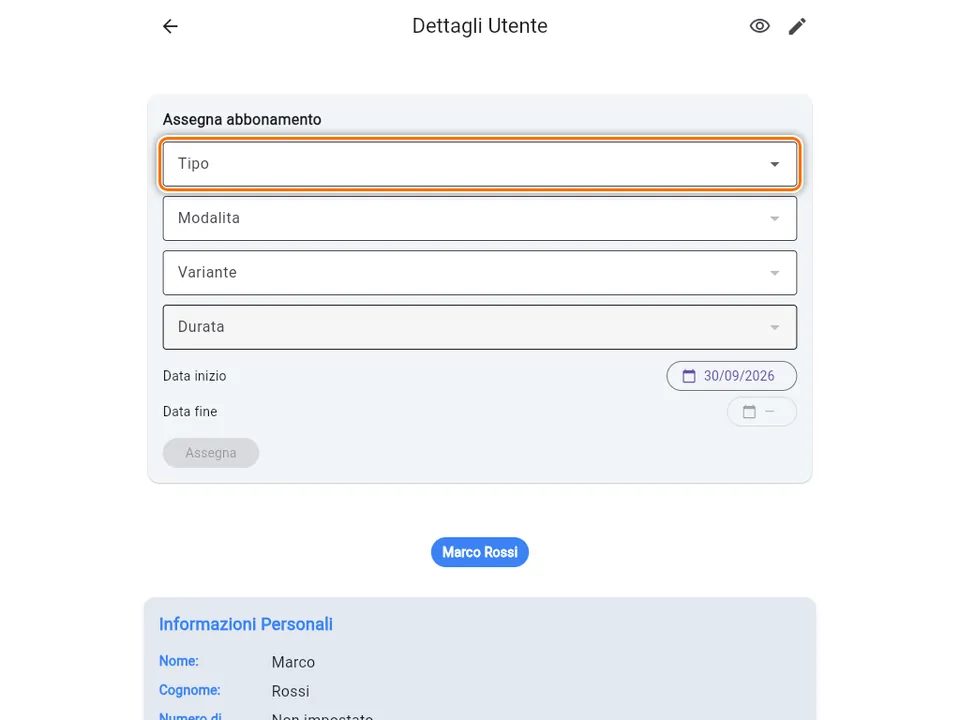
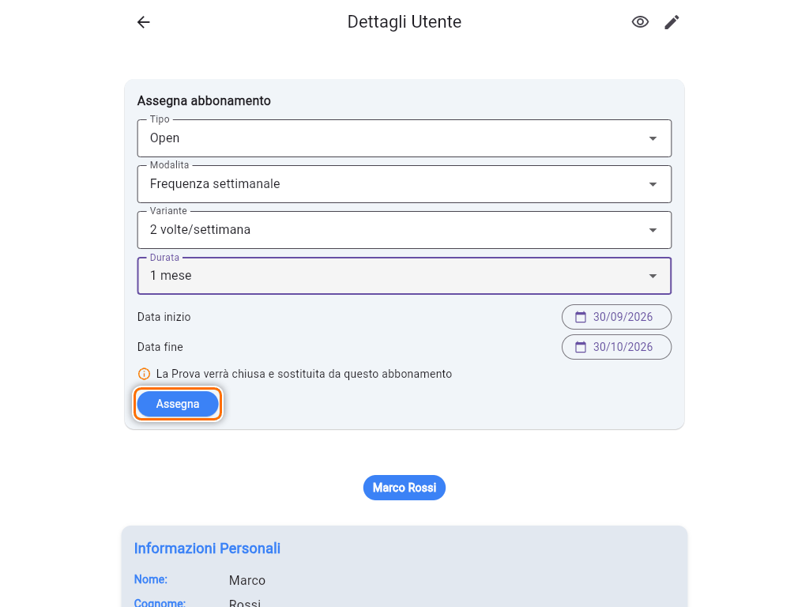
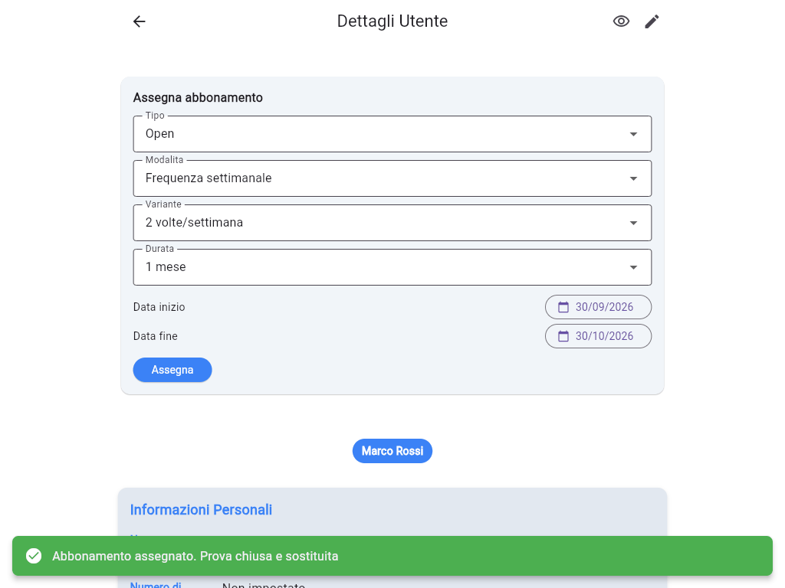
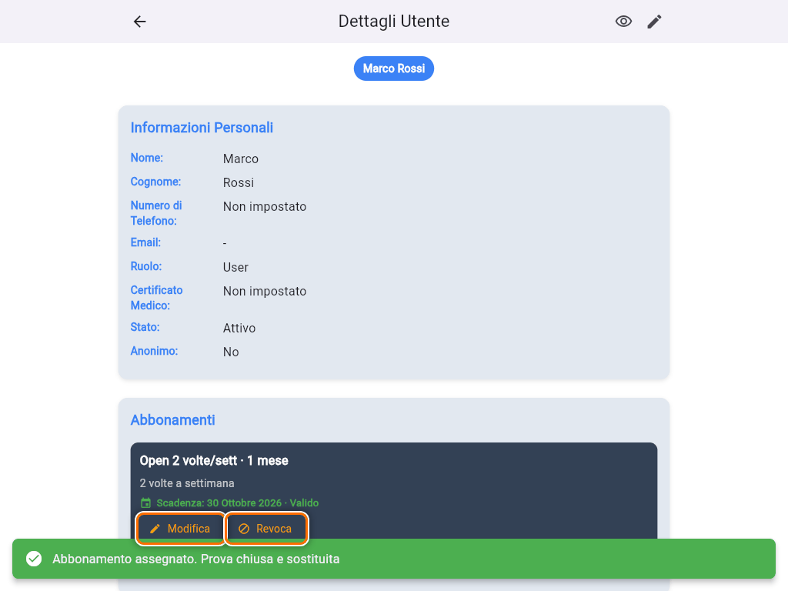
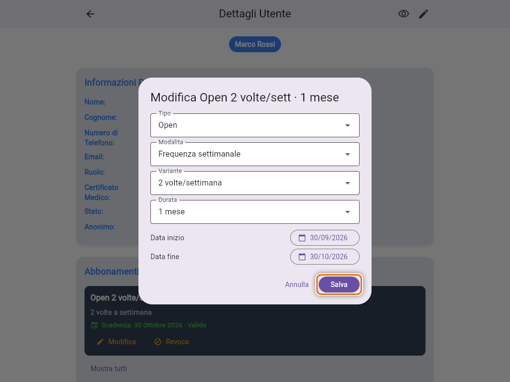
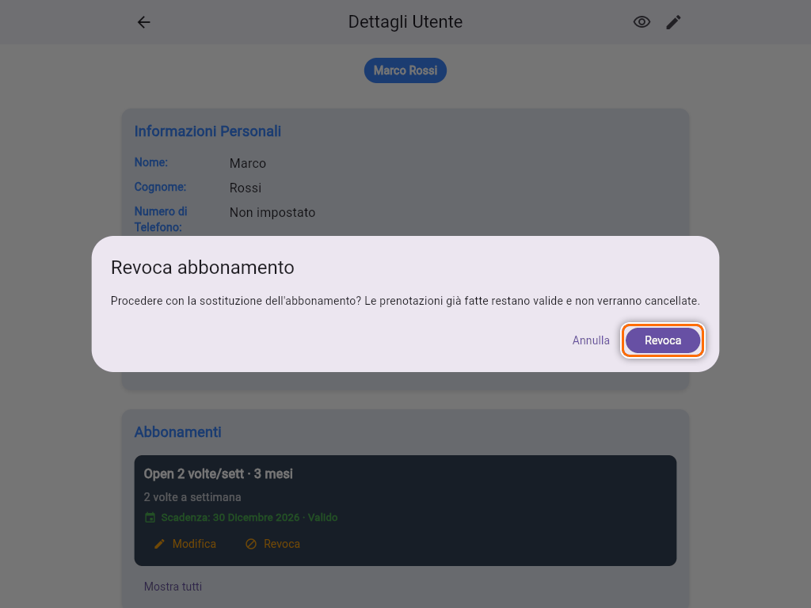
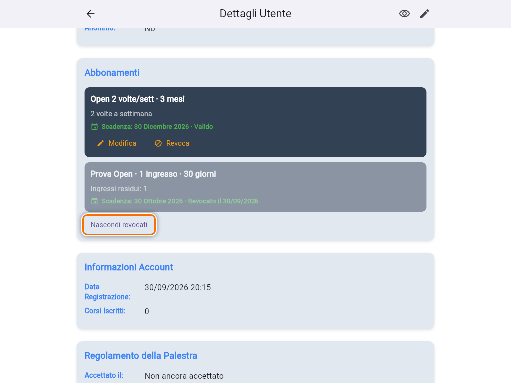
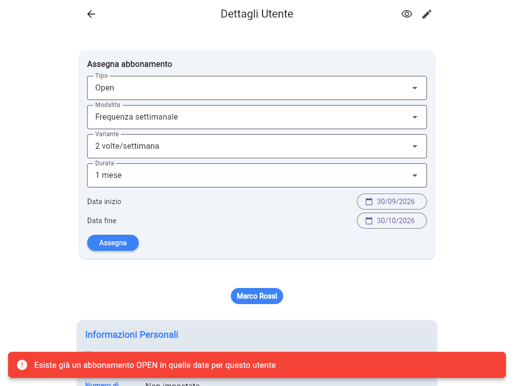

# Assegnare, modificare e revocare un abbonamento

Gli abbonamenti si gestiscono dal **dettaglio del socio**: apri **Utenti**, cerca il socio e tocca **(i)** "Dettagli" (vedi [Gestire un utente](guida:gestione-utente)).

## I piani disponibili

| Tipo | Modalita | Varianti | Durate |
|---|---|---|---|
| **Open** | Frequenza settimanale | 2 volte/settimana, 3 volte/settimana, Illimitato | 1, 3, 6, 12 mesi |
| **Open** | Pacchetto ingressi | 10 ingressi | 1, 3, 6, 12 mesi |
| **Personal Trainer** | Pacchetto ingressi | 10 ingressi | 1, 3, 6, 12 mesi |

La **Prova Open** (1 ingresso, 30 giorni) non si assegna da qui. Arriva da sola a chi si registra dall'app, oppure la scegli come **Piano iniziale** quando crei l'utente (vedi [Registrare un nuovo utente](guida:registrazione-utente)).

Un socio può avere insieme un abbonamento **Open** e uno **Personal Trainer**. Non può averne due della stessa famiglia nello stesso periodo.

## Assegnare un abbonamento

1. Nella card **Assegna abbonamento** scegli i quattro campi in ordine: **Tipo**, **Modalita**, **Variante**, **Durata**. Ogni campo si attiva dopo quello sopra.

   

2. Controlla le date. **Data inizio** è oggi, **Data fine** si calcola dalla durata: 1 mese dal 30/09 finisce il 30/10. Toccale per cambiarle.
3. Tocca **Assegna**.

   

Compare **"Abbonamento assegnato"**, e il nuovo abbonamento è nella sezione **Abbonamenti** più in basso.

### Le date

Le date sono **giorni interi**: l'abbonamento vale dalle 00:00 del giorno di inizio alle 23:59 del giorno di fine, ora italiana. Inizio e fine possono cadere nello stesso giorno.

Puoi dare un abbonamento che **inizia in futuro**, per esempio un rinnovo che parte quando finisce quello attuale. Nell'elenco compare come **"Inizia il …"**, e il socio può già prenotare i corsi da quella data in poi.

### Sostituire la Prova

Se il socio ha una **Prova** attiva e gli assegni un abbonamento **Open**, la card avvisa **"La Prova verrà chiusa e sostituita da questo abbonamento"**. Dopo l'assegnazione il messaggio è **"Abbonamento assegnato. Prova chiusa e sostituita"**: la Prova viene revocata in automatico e non devi fare altro.

Per i soci con la vecchia Prova ancora valida, può sostituirla solo un abbonamento **Open che inizia entro la scadenza della Prova**. La card lo segnala con "La Prova è attiva fino al …" e non ti fa assegnare altro.

## Modificare un abbonamento

Nella sezione **Abbonamenti** ogni abbonamento ha **Modifica** e **Revoca**.

1. Tocca **Modifica**.
2. Cambia il piano, le date o, per i pacchetti, gli **Ingressi residui** (vedi [Pacchetti a ingressi](guida:pacchetti-ingressi)).
3. Tocca **Salva**. Compare **"Abbonamento modificato"**.

Se cambi piano o durata, la data di fine e gli ingressi si ricalcolano, a meno che tu non li abbia già cambiati a mano. Gli eventuali errori compaiono in rosso dentro il dialog, sopra **Salva**.

## Revocare un abbonamento

1. Tocca **Revoca** sull'abbonamento.
2. Conferma con **Revoca**.

L'abbonamento revocato non vale più per prenotare, ma **resta nello storico**: tocca **Mostra tutti** per vederlo, con la data della revoca.

> **Attenzione:** né la revoca né la modifica cancellano le prenotazioni già fatte. Se un socio non deve più venire a un corso, toglilo dal corso a mano (vedi [Iscrivere o rimuovere un socio da un corso](guida:iscrivere-socio-a-corso)).

## Errori frequenti

- **"Esiste già un abbonamento OPEN in quelle date per questo utente"** (o **PT**): il socio ha già un abbonamento della stessa famiglia che si sovrappone a quelle date. Puoi:
  - modificare quello esistente;
  - revocarlo e assegnare il nuovo;
  - far iniziare il nuovo il giorno dopo la fine di quello attuale.

  

- **"La data di fine non può precedere la data di inizio"**: correggi le date.
- **"L'utente è ancora sul modello legacy: eseguire prima la migrazione"**: il socio ha ancora il vecchio tipo di abbonamento. Prima va migrato (vedi [Migrare un utente dal vecchio abbonamento](guida:migrazione-utente-legacy)).
- **"Gli ingressi sono cambiati nel frattempo: ricarica e riprova"**: vedi [Pacchetti a ingressi](guida:pacchetti-ingressi).
