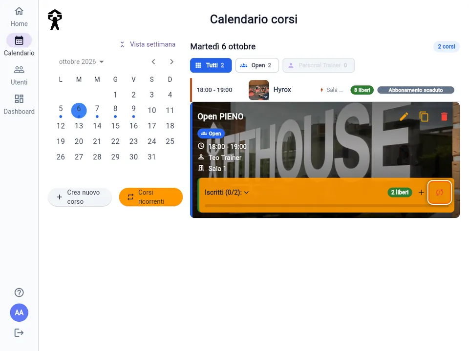
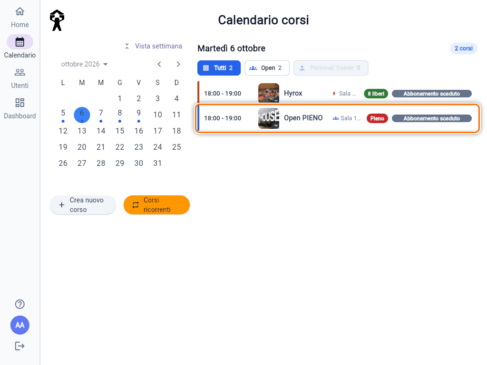
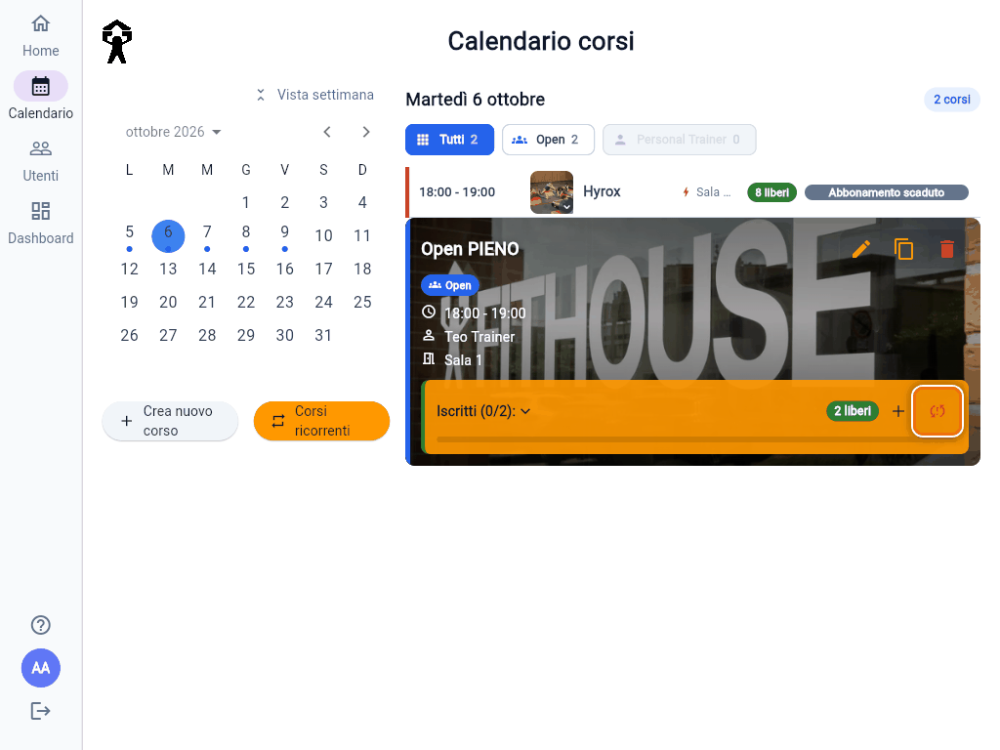
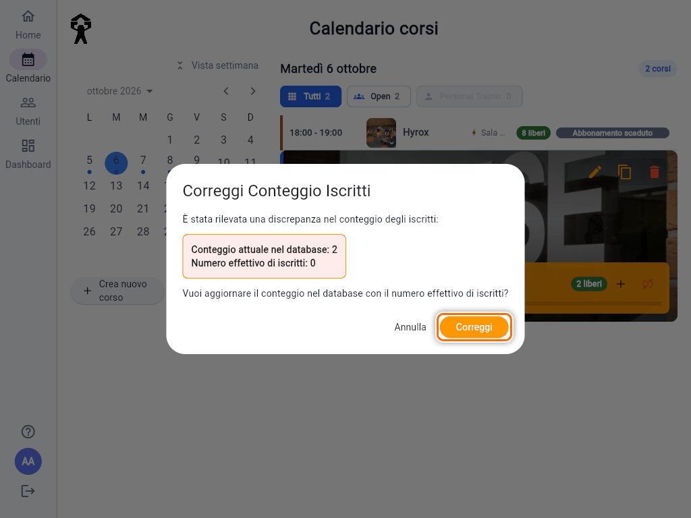
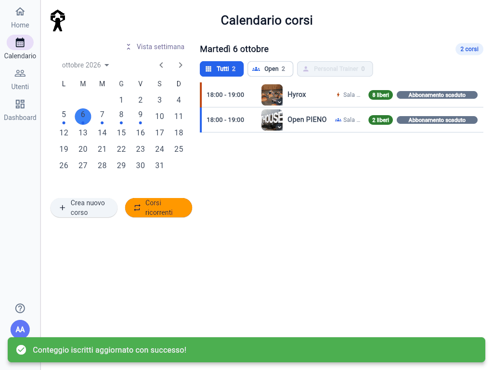

# Correggere il conteggio degli iscritti

Ogni corso tiene un **contatore** degli iscritti, che decide i posti liberi e quando il corso è pieno. Di rado, per esempio dopo vecchie operazioni fatte prima degli ultimi aggiornamenti dell'app, il contatore non corrisponde più ai soci davvero iscritti. Un corso può risultare **pieno** anche se in realtà ha posti, o viceversa.

## Come te ne accorgi

- Nell'elenco del giorno il corso sembra pieno, o con pochi posti, ma gli iscritti sono meno.

  

- Aprendo il corso, il riquadro **Iscritti** è **arancione** e accanto al **+** c'è un'**icona rossa con le frecce**, "Correggi conteggio iscritti". La vedono solo gli Admin.

  

Il numero tra parentesi in **Iscritti (N/M)** è quello **vero**, contato sui soci. È il contatore nascosto a essere sbagliato: nell'esempio il corso risulta pieno, ma gli iscritti veri sono 0 su 2.

## Correggere

1. Tocca l'icona rossa.
2. Il dialog **Correggi Conteggio Iscritti** mostra i due numeri: **Conteggio attuale nel database** e **Numero effettivo di iscritti**.
3. Tocca **Correggi**.

Compare **"Conteggio iscritti aggiornato con successo!"**, il riquadro torna normale e i posti liberi sono di nuovo giusti.

## Da sapere

- Non scrivi tu nessun numero: l'app **riconta i soci iscritti** e salva quel valore. Se uno è iscritto davvero, resta iscritto.
- La correzione non tocca ingressi, abbonamenti o lista d'attesa: sistema solo il contatore.
- Se dopo la correzione l'icona ricompare sullo stesso corso, segnalalo a chi gestisce l'app, indicando corso e giorno.
