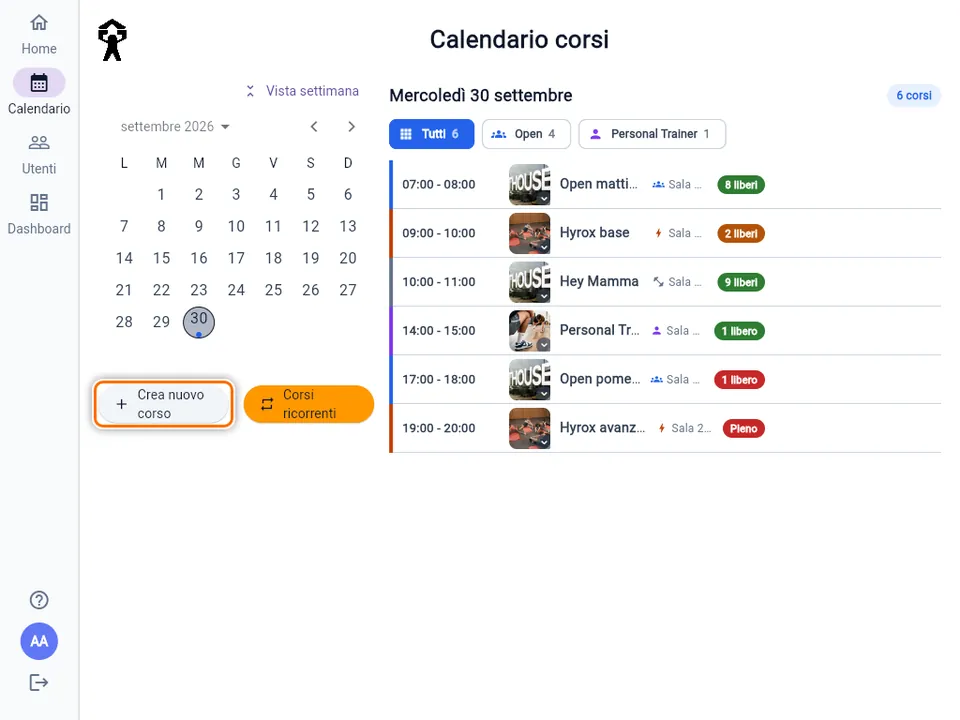
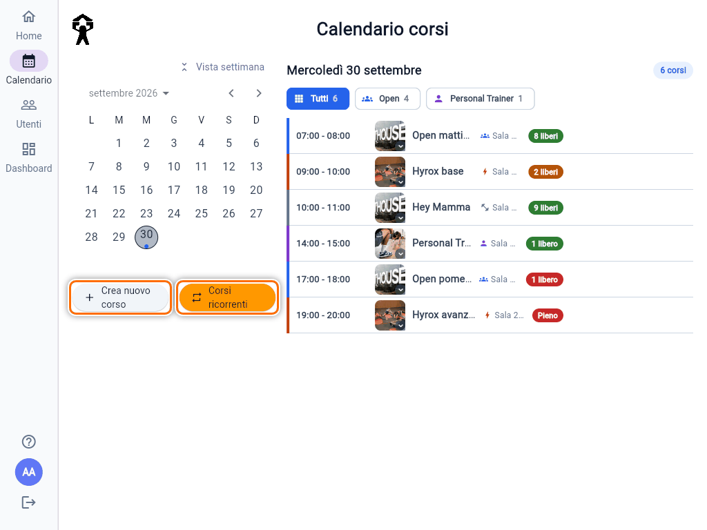
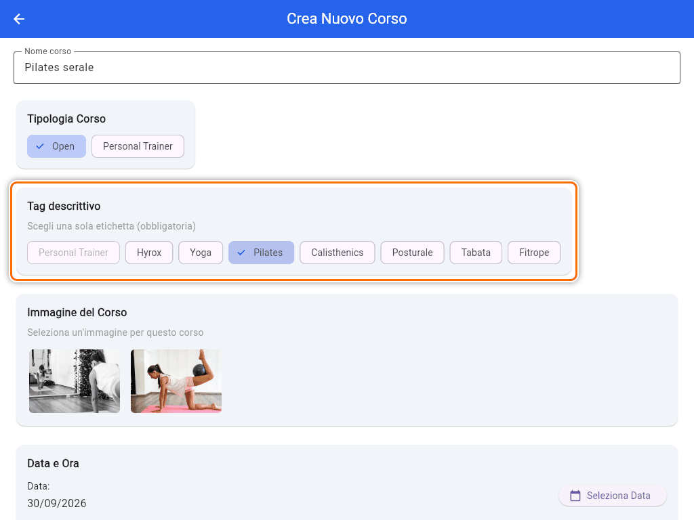
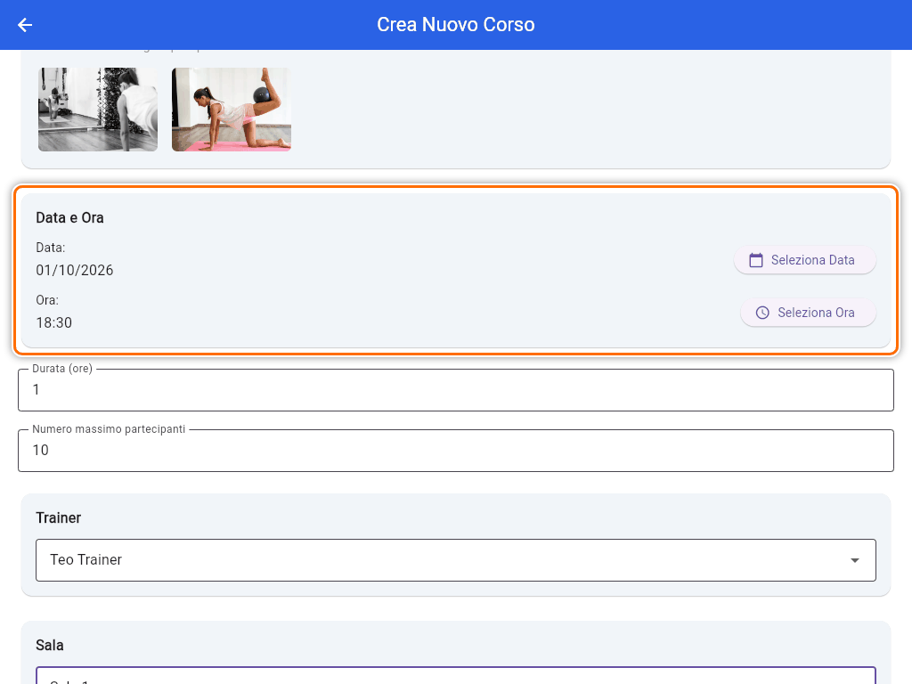
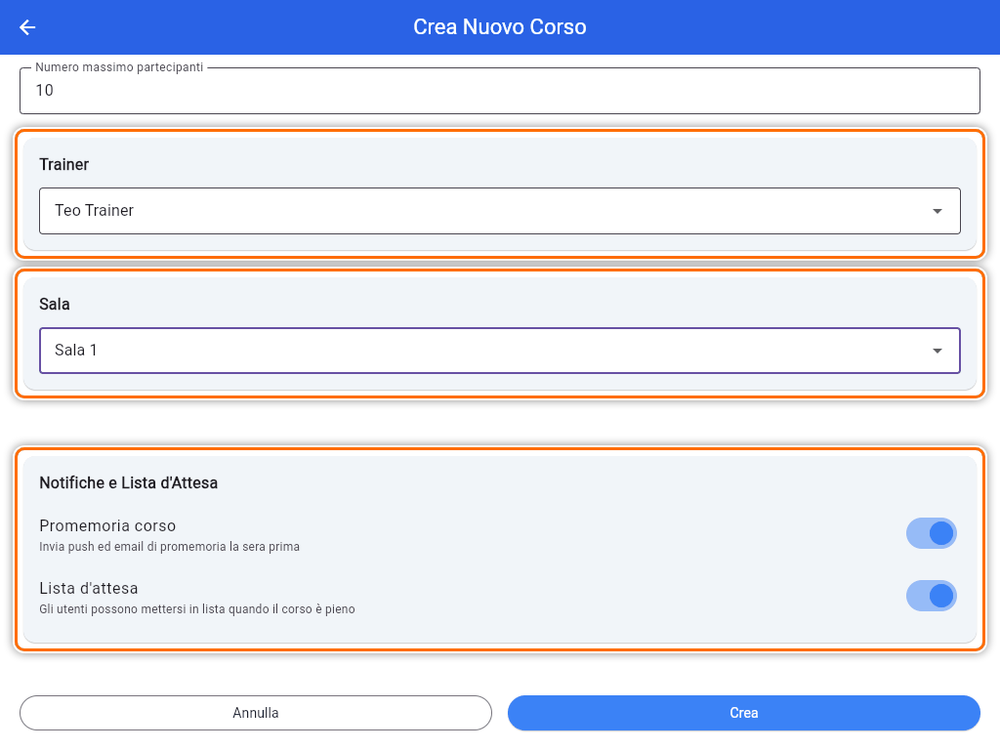
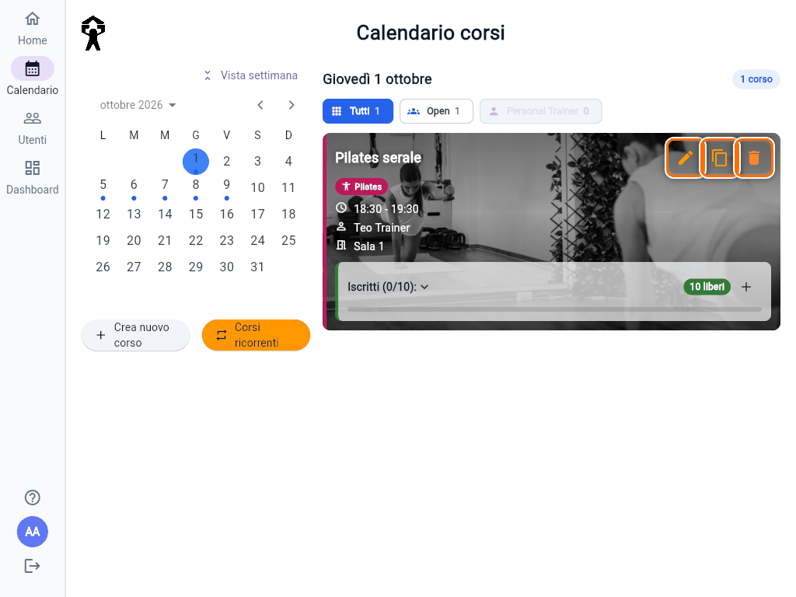
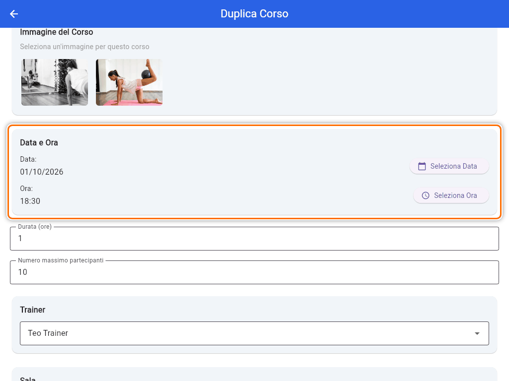
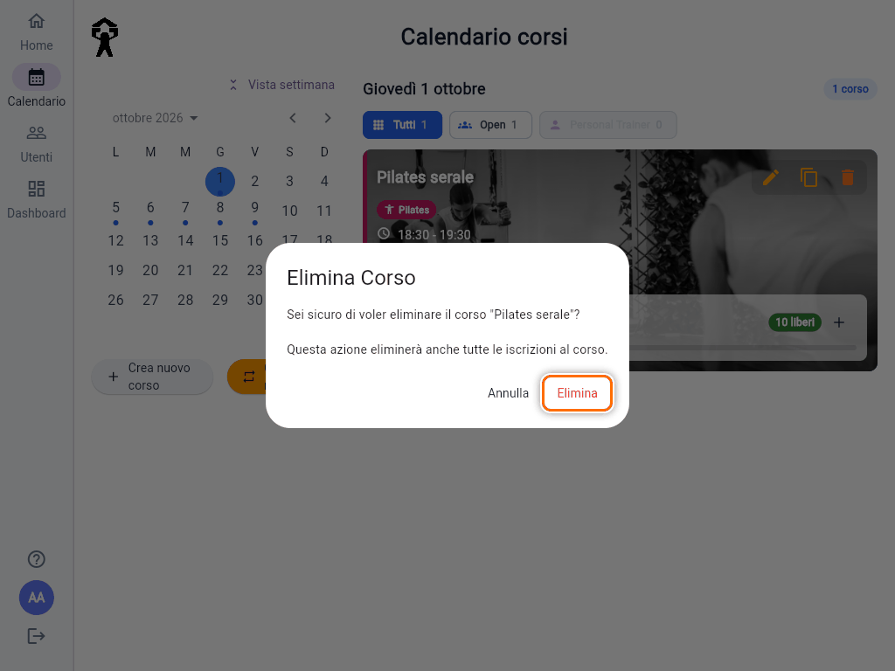
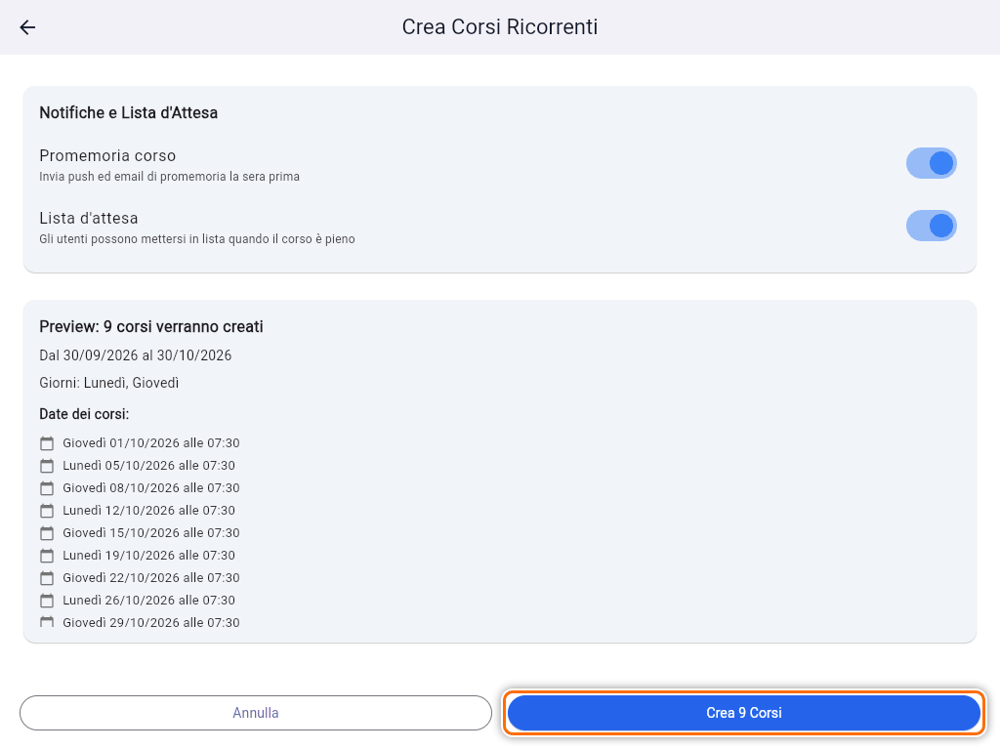

# Creare e gestire i corsi

I corsi si gestiscono dalla sezione **Calendario**. Sotto il calendario ci sono **Crea nuovo corso** e **Corsi ricorrenti**. Su telefono e tablet li trovi nel pulsante rotondo in basso a destra ("Azioni corso").

Tocca un giorno del calendario per vedere i suoi corsi a destra. **Vista settimana** e **Vista mese** cambiano la visualizzazione.

> **Nota:** accanto ai corsi futuri vedi un pulsante grigio **"Abbonamento scaduto"**. È il pulsante di prenotazione, calcolato sul **tuo** profilo, e un Admin non ha abbonamenti: ignoralo.

## Creare un corso

1. Tocca **Crea nuovo corso**.
2. Scrivi il **Nome corso**.
3. In **Tipologia Corso** scegli **Open** o **Personal Trainer**. La tipologia decide **chi può prenotare**: un corso Open lo prenota chi ha un abbonamento Open, un corso Personal Trainer chi ha un pacchetto PT.
4. In **Tag descrittivo** scegli un'etichetta, obbligatoria: Hyrox, Yoga, Pilates, Calisthenics, Posturale, Tabata, Fitrope. Per i corsi Personal Trainer il tag è sempre Personal Trainer. Il tag serve solo a descrivere il corso: non cambia chi può prenotare.

   

5. Se vuoi, scegli un'**Immagine del Corso**.
6. In **Data e Ora** tocca **Seleziona Data** e **Seleziona Ora**. Nel selettore dell'ora, l'icona della tastiera ti permette di scrivere ore e minuti.

   

7. Controlla la **Durata (ore)** e il **Numero massimo partecipanti**. Di partenza sono 6 posti per un corso Open e 1 per un Personal Trainer.
8. Scegli il **Trainer** e la **Sala**, entrambi obbligatori.
9. In **Notifiche e Lista d'Attesa** decidi se tenere accesi:
   - **Promemoria corso**: i prenotati ricevono push ed email la sera prima;
   - **Lista d'attesa**: quando il corso è pieno, i soci possono mettersi in coda. Se la spegni, un corso pieno mostra solo "Corso pieno".

   

10. Tocca **Crea**. Compare **"Corso creato con successo"**.

Se manca qualcosa, sopra i pulsanti compare un riquadro rosso che dice cosa correggere, per esempio "Seleziona una sala" o "Non puoi creare un corso nel passato".

## Modificare, duplicare, eliminare

Tocca un corso nell'elenco del giorno per aprirlo. In alto a destra ci sono tre icone:

- **Modifica corso** (matita): cambi nome, orario, posti, trainer, sala e notifiche. Iscritti e lista d'attesa restano. La durata non si può cambiare. L'icona c'è solo per i corsi **non ancora iniziati**.
- **Duplica corso** (due fogli): apre lo stesso modulo già compilato, con la stessa durata e **nessun iscritto**. **Cambia la data** prima di toccare **Duplica**, altrimenti crei una copia nello stesso giorno. Funziona anche sui corsi passati: è il modo più veloce per ripetere un corso della settimana scorsa.

  

- **Elimina corso** (cestino rosso): chiede conferma e avvisa che verranno eliminate anche tutte le iscrizioni.

  

### Cosa succede eliminando un corso

- **Corso futuro**: ogni iscritto riceve indietro l'ingresso o la lezione, e la lista d'attesa si svuota. I soci **non ricevono un'email**: se serve, avvisali tu.
- **Corso già iniziato o passato**: nessun rimborso, perché la lezione c'è stata. Serve solo a tenere in ordine il calendario.

I corsi storici non convertiti, come **Hey Mamma**, sono in sola lettura: se provi a modificarli compare "I corsi storici non migrati sono disponibili in sola lettura".

## Corsi ricorrenti

Per creare in un colpo solo lo stesso corso su più giorni, per esempio "Yoga il lunedì e il giovedì per un mese":

1. Tocca **Corsi ricorrenti**.
2. Compila i campi come per un corso singolo.
3. In **Data di Inizio** scegli il primo giorno e l'**ora**, in **Data di Fine Programazione** l'ultimo giorno.
4. In **Giorni della Settimana** spunta i giorni.
5. Controlla l'anteprima **"Preview: N corsi verranno creati"**, con l'elenco delle date.
6. Tocca **Crea N Corsi**.

Regole:

- si può programmare fino a **5 mesi** da oggi ("La data di fine non può essere oltre 5 mesi da oggi");
- all'apertura la data di fine è a 30 giorni, e l'ora di partenza è quella attuale: **cambiala**;
- se qualcosa va storto a metà ("Creati solo X corsi su Y"), i corsi già creati restano. Controlla il calendario prima di riprovare, per non doppiarli.

Per iscrivere un socio a un corso, vedi [Iscrivere o rimuovere un socio da un corso](guida:iscrivere-socio-a-corso).
