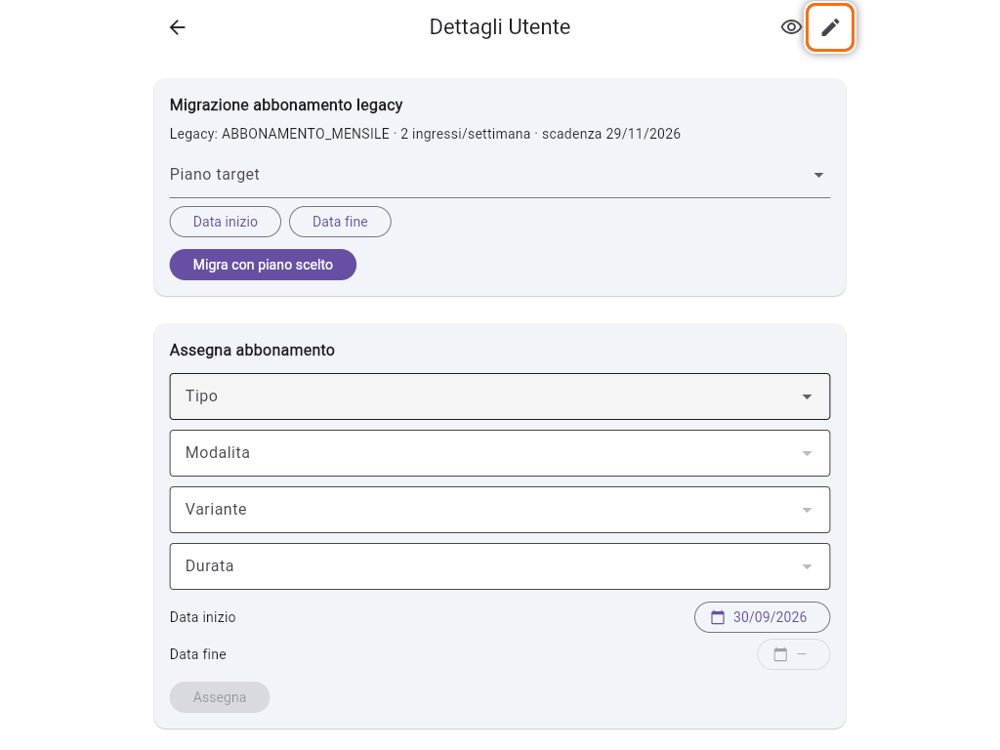
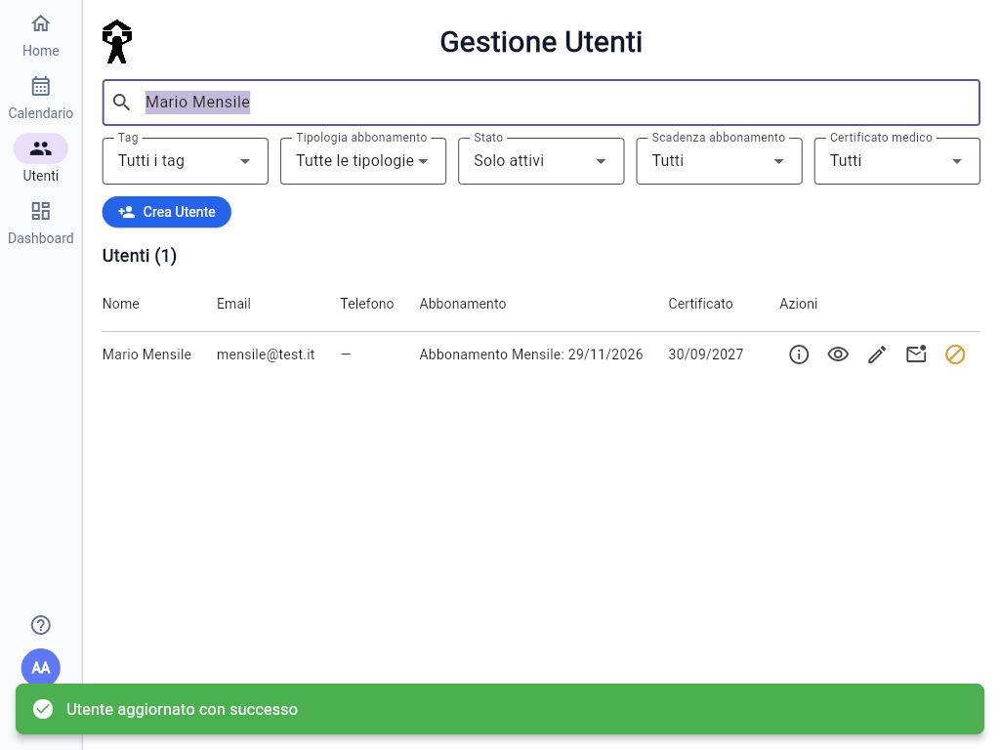
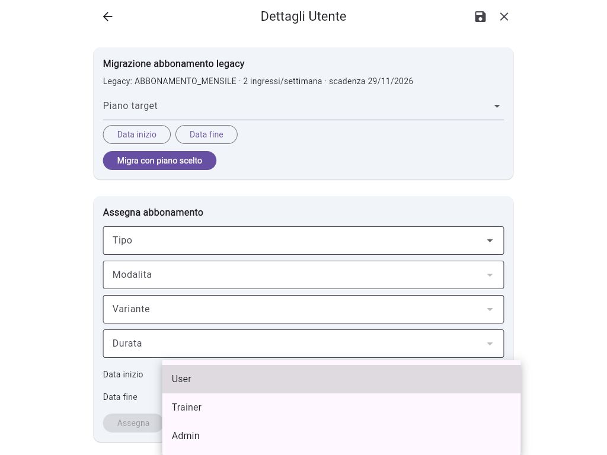
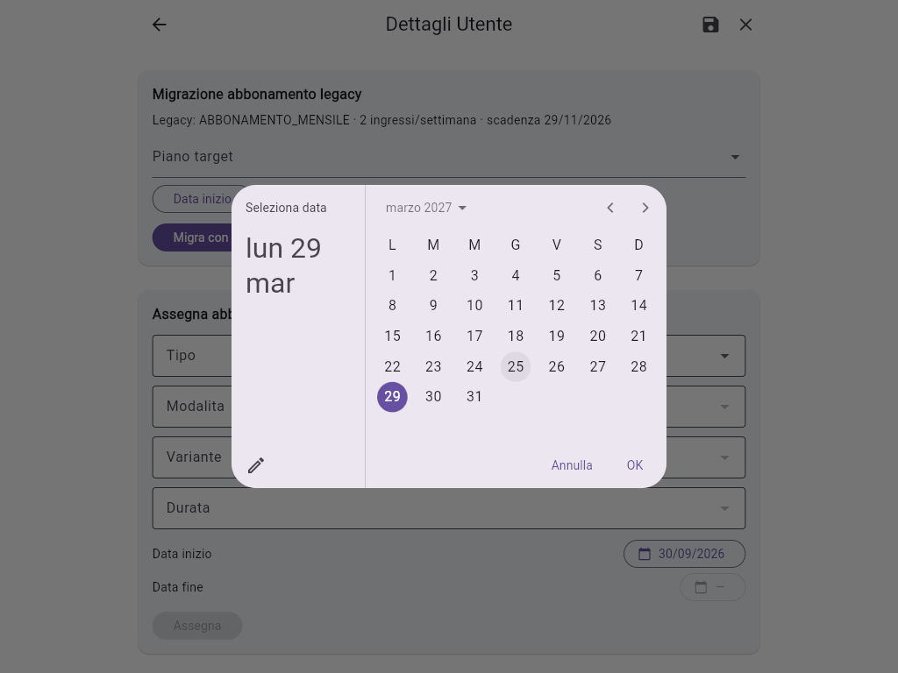
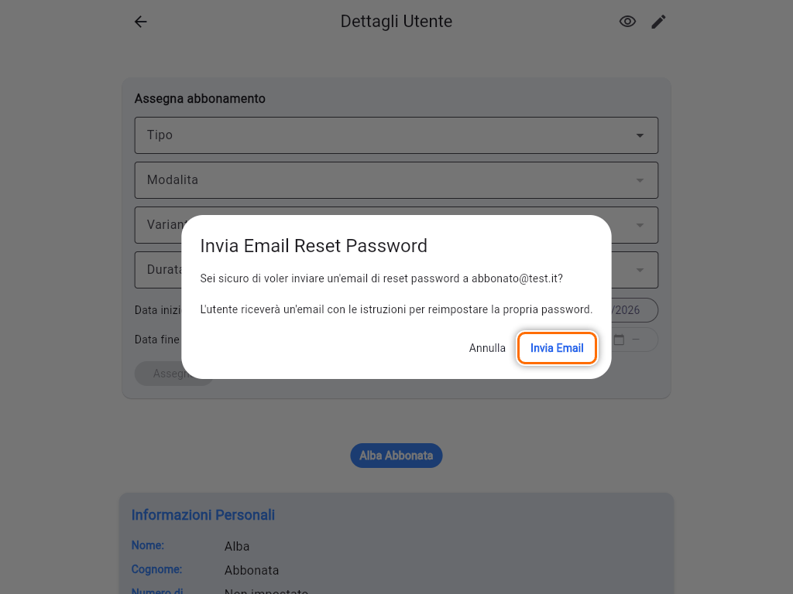
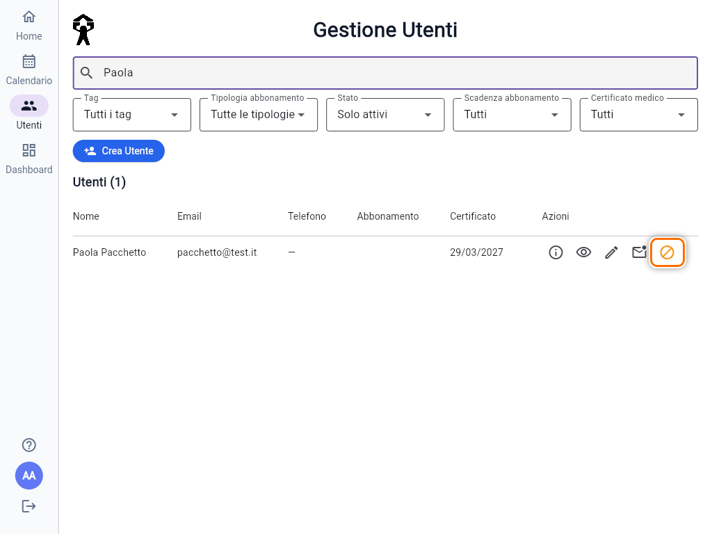
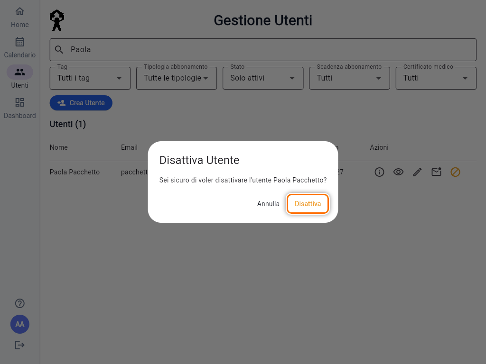
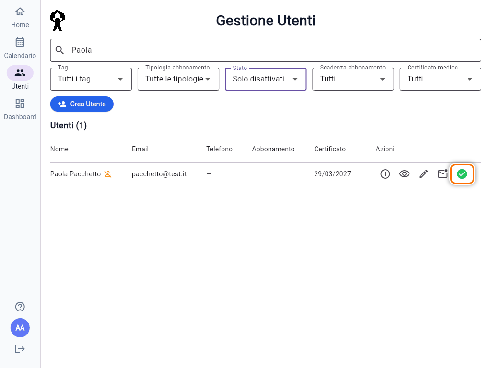
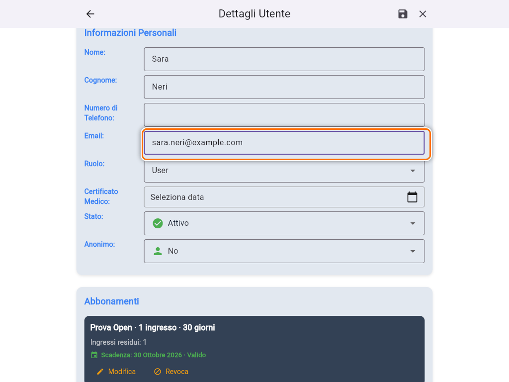
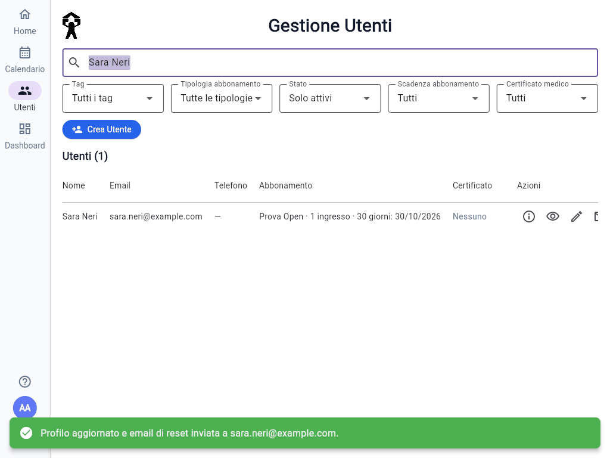

# Gestire un utente

Tutto quello che riguarda un socio o un membro dello staff si trova nella sua pagina **Dettagli Utente**.

## Aprire il dettaglio

1. Apri **Utenti** dal menu a sinistra.
2. Scrivi nome, cognome o email in **Cerca utenti...**.
3. Nella colonna **Azioni** tocca l'icona **(i)**, "Dettagli". In alternativa tocca la riga.

In cima alla pagina ci sono le card degli abbonamenti (vedi [Assegnare, modificare e revocare un abbonamento](guida:abbonamenti)). Scorrendo verso il basso trovi **Informazioni Personali**, lo storico e il regolamento.

## Modificare anagrafica, ruolo e stato

1. Tocca la **matita** in alto a destra ("Modifica profilo"). I campi di **Informazioni Personali** diventano modificabili.

   

2. Cambia i campi che ti servono:
   - **Nome**, **Cognome**, **Numero di Telefono** (10 cifre);
   - **Email**: vedi più sotto "Aggiungere o cambiare l'email";
   - **Ruolo**: **User** per i soci, **Trainer** per gli istruttori, **Admin** per chi gestisce la palestra;
   - **Stato**: **Attivo** o **Disattivato**;
   - **Anonimo**: se **Sì**, gli altri soci vedono "(Anonimo)" al posto del suo nome negli elenchi degli iscritti. Tu continui a vedere il nome, seguito da "- (Anonimo)".
3. Tocca il **dischetto** ("Salva modifiche"). Per uscire senza salvare usa la **X**.

Dopo il salvataggio compare **"Utente aggiornato con successo"** e torni all'elenco.

### Creare un Trainer o un Admin

Non esiste un modulo apposta: si crea l'utente e poi si cambia il **Ruolo**.

- Un **Trainer** vede i soci e i loro corsi, ma può modificare solo nome, cognome, telefono e anonimato. Non gestisce abbonamenti.
- Un **Admin** può fare tutto, compresa questa guida. Dai questo ruolo solo a chi gestisce davvero la palestra.

Cambiare ruolo non tocca gli abbonamenti già assegnati.

## Certificato medico

1. In modifica, tocca la data accanto a **Certificato Medico**, oppure **Seleziona data** se non c'è ancora.
2. Scegli la data di **scadenza** del certificato e tocca **OK**. La **matita** del calendario ti permette di scriverla (es. 30/9/2027).
3. Salva con il dischetto.

Fuori dalla modifica il certificato compare come **Valido**, **Scade tra N giorni** (negli ultimi 15 giorni) o **Scaduto**. I soci da controllare sono raccolti nella card **Certificati medici da verificare** della Home (vedi [Home e Dashboard](guida:home-e-dashboard)). Nella pagina Utenti puoi anche filtrare per **Certificato medico**.

## Inviare di nuovo l'email per la password

Quando un socio ha dimenticato la password o non ha mai ricevuto l'email iniziale:

1. Nel dettaglio tocca **Invia Email Reset Password**. Dall'elenco puoi usare l'icona della busta.
2. Conferma con **Invia Email**.

Il socio riceve un link per scegliere una nuova password. La password non la vedi e non la scegli tu. Se l'email non arriva, chiedigli di controllare lo **spam**.

## Disattivare e riattivare un utente

Disattiva un socio quando non deve più entrare nell'app, per esempio se ha lasciato la palestra. I suoi dati e il suo storico restano.

1. In **Utenti** tocca l'icona arancione **Disattiva** nella riga del socio.

   

2. Conferma con **Disattiva**.

   

Un utente disattivato che prova a entrare vede "Il tuo account è stato disattivato". Di norma sparisce dall'elenco, perché il filtro **Stato** mostra **Solo attivi**. Per ritrovarlo scegli **Solo disattivati**, poi tocca l'icona verde **Attiva**.

Anche un socio può chiudere da solo il proprio account dal suo profilo: il risultato è lo stesso, e solo un Admin può riattivarlo.

## Aggiungere o cambiare l'email

Serve per un socio creato **senza email** che ora vuole usare l'app, o per un socio che ha cambiato indirizzo.

1. Nel dettaglio tocca la **matita**.
2. Scrivi il nuovo indirizzo nel campo **Email**.

   

3. Salva con il dischetto.

L'app crea o aggiorna l'accesso del socio e gli manda subito l'email per impostare la password: **"Profilo aggiornato e email di reset inviata a …"**.

- Se compare **"Email aggiornata, ma invio reset fallito: puoi ritentare dal pulsante dedicato."**, l'email è salvata e devi solo usare **Invia Email Reset Password**.
- Se l'indirizzo è già di un altro socio, l'errore compare sotto il campo: cerca quel socio in **Utenti**.
- Non puoi cancellare l'email di un socio che ce l'ha: se serve davvero, concorda la procedura con chi gestisce l'app.
