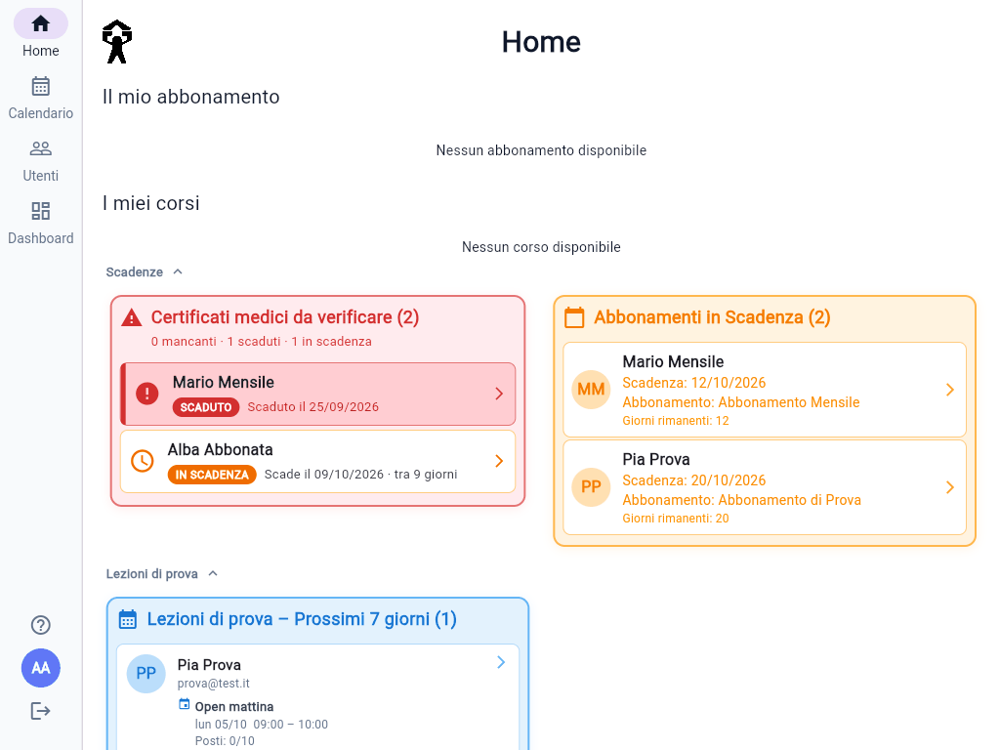
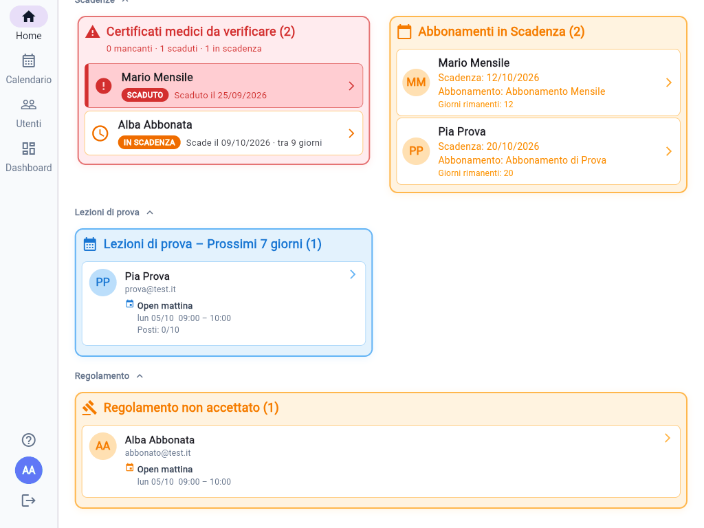
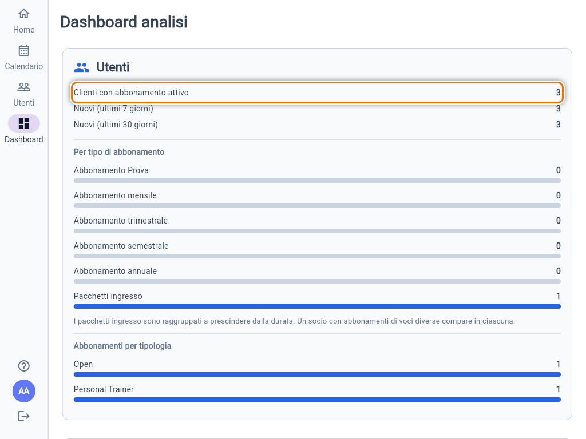
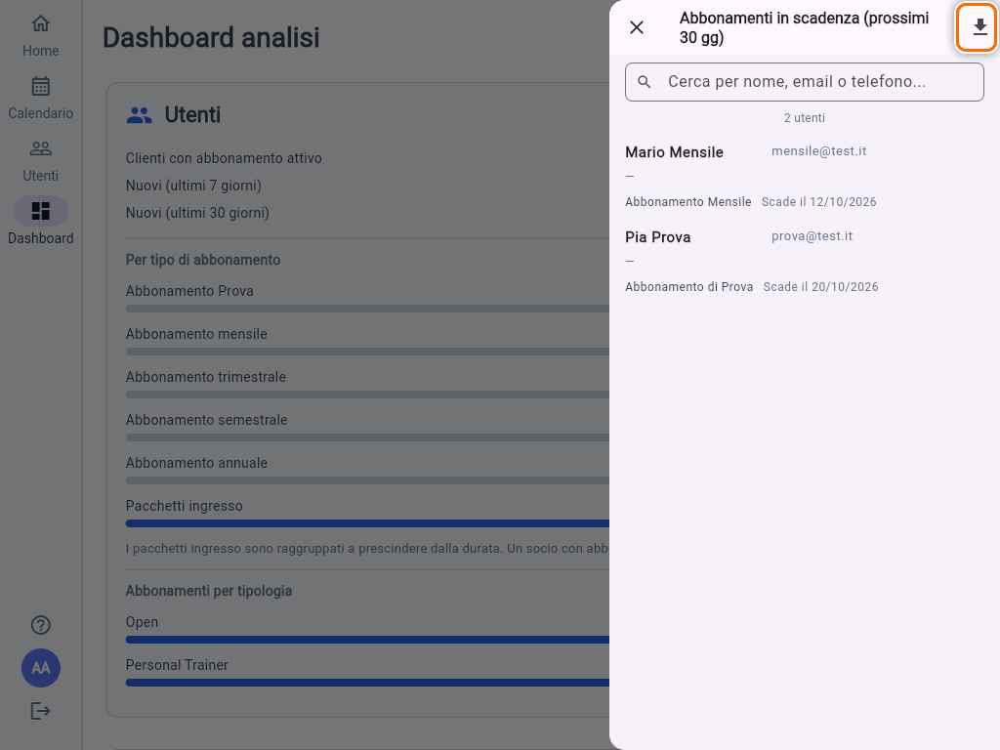

# Home e Dashboard

## La Home dell'Admin

Oltre alle sezioni che vede ogni socio, la **Home** di un Admin raccoglie le cose da controllare, divise in tre gruppi: **Scadenze**, **Lezioni di prova** e **Regolamento**. Tocca il titolo di un gruppo per chiuderlo o riaprirlo. Una card vuota non compare. Tocca una riga per aprire il dettaglio del socio.

### Certificati medici da verificare

Elenca i soci **con un abbonamento valido**, Prova esclusa, il cui certificato:

- **MANCANTE**: non è mai stato inserito;
- **SCADUTO**: è già scaduto;
- **IN SCADENZA**: scade entro **15 giorni**.

In cima la card riassume quanti mancano, quanti sono scaduti e quanti in scadenza. Per aggiornare la data, apri il socio e segui [Gestire un utente](guida:gestione-utente). L'elenco si aggiorna ogni pochi minuti. Per una ricerca più ampia, fino a 30 giorni, usa il filtro **Certificato medico** in **Utenti**.

### Abbonamenti in Scadenza

I soci con un abbonamento che finisce **entro 30 giorni**, con i giorni rimanenti (in rosso negli ultimi 3). È il promemoria per i rinnovi: assegna il nuovo abbonamento facendolo partire dal giorno dopo la scadenza (vedi [Assegnare, modificare e revocare un abbonamento](guida:abbonamenti)).

### Lezioni di prova e regolamento

- **Lezioni di prova – Prossimi 7 giorni**: chi è in prova e ha una lezione prenotata a breve, con corso, giorno e posti. Utile per accogliere i nuovi.
- **Ultime lezioni di prova**: chi ha fatto la prova negli ultimi 15 giorni. È il momento giusto per proporre un abbonamento.
- **Regolamento non accettato**: i soci con un corso nei prossimi 7 giorni che non hanno ancora accettato il regolamento. L'app glielo chiederà alla prossima prenotazione. Se si presentano in palestra, ricordaglielo.

Su telefono e tablet le card sono una sotto l'altra, e quella del regolamento non c'è: la trovi solo su computer.

## La Dashboard

La **Dashboard** (solo da computer) mostra i numeri della palestra, divisi in quattro riquadri:

- **Utenti**: clienti con abbonamento attivo, nuovi iscritti degli ultimi 7 e 30 giorni, suddivisione per tipo di abbonamento e per tipologia (Open o Personal Trainer);
- **Corsi**: corsi degli ultimi 6 mesi, corsi al completo, tasso di riempimento medio e tipologie;
- **Abbonamenti**: abbonamenti in scadenza nei prossimi 30 giorni, divisi per tipo, e ingressi medi residui dei pacchetti;
- **Clienti con nessun abbonamento attivo**: i profili attivi senza nessun abbonamento valido.

Per **clienti** si intendono i profili attivi con almeno un abbonamento non scaduto. **Abbonamenti in scadenza** conta gli abbonamenti, non le persone: un socio con due abbonamenti in scadenza vale due.

## Elenchi ed esportazione CSV

Tocca un numero o una barra per aprire a destra l'**elenco dei soci** che lo compongono. Puoi cercare per nome, email o telefono e aprire ogni socio.

L'icona in alto a destra dell'elenco, **Esporta in CSV**, scarica un file con **i soci che vedi in quel momento**. Se hai scritto qualcosa nella ricerca, esporta solo quelli.

Il file si apre direttamente con **Excel**. Contiene, per ogni socio, anagrafica, contatti, ruolo, stato, data di registrazione, abbonamenti attivi con le scadenze, scadenza del certificato, data di accettazione del regolamento e preferenze di notifica. Le date sono nel formato gg/mm/aaaa.
