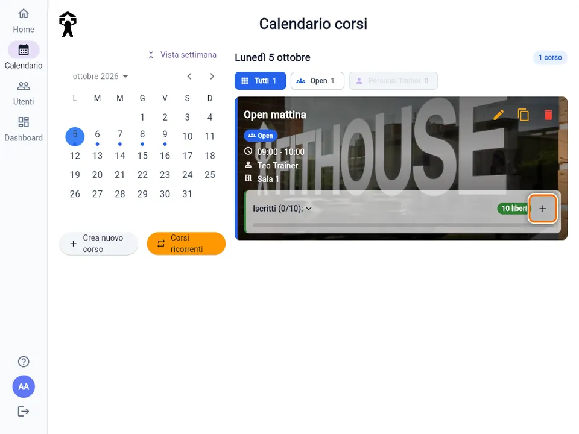
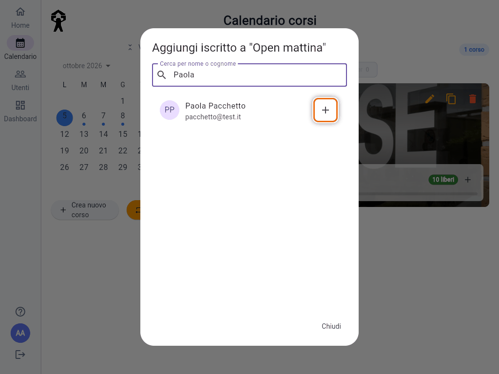
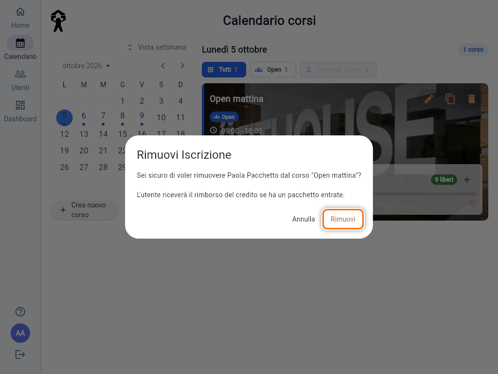
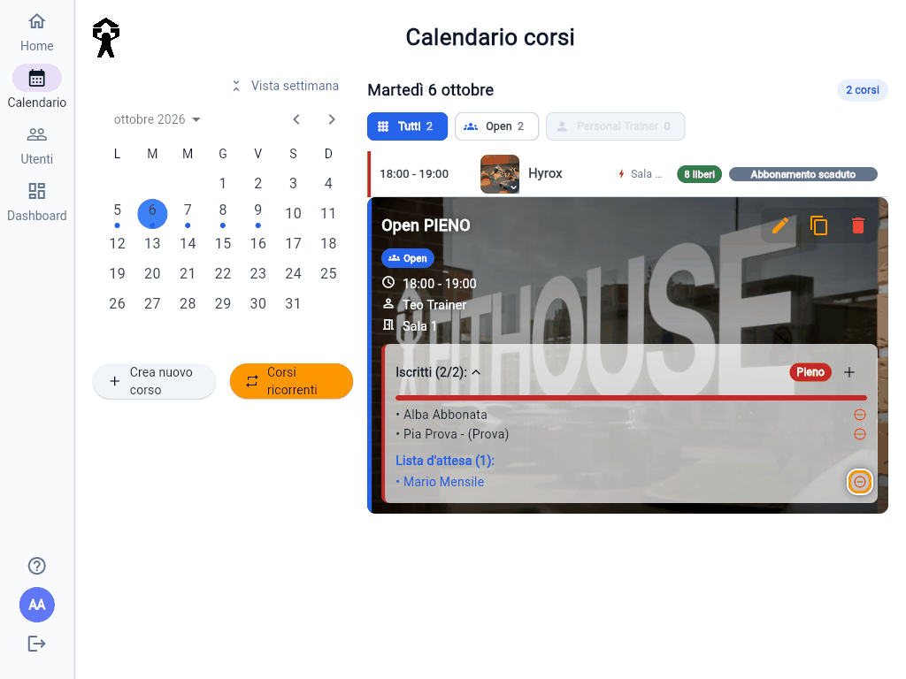

# Iscrivere o rimuovere un socio da un corso

Dalla reception puoi prenotare un corso al posto di un socio e togliere un'iscrizione. Si fa tutto dalla card del corso in **Calendario**.

## Aprire il corso

1. Apri **Calendario** e tocca il giorno.
2. Tocca il corso nell'elenco: si apre la card con i dettagli.
3. Il riquadro **Iscritti (N/M)** mostra quanti sono gli iscritti. Toccalo per vedere i nomi e la lista d'attesa.

## Aggiungere un iscritto

1. Nella card tocca il **+**, "Aggiungi iscritto".

   

2. Cerca il socio in **Cerca per nome o cognome**.
3. Tocca il **+** accanto al suo nome, "Aggiungi al corso".

   

La finestra si chiude e il socio è tra gli iscritti. Non compare un messaggio di conferma: controlla il riquadro **Iscritti**.

### Cosa salta l'iscrizione dalla reception

Quando iscrivi tu un socio, l'app **non applica i controlli** che valgono quando prenota da solo:

- posti esauriti: puoi superare la capienza;
- tipologia del corso non coperta dall'abbonamento;
- abbonamento scaduto;
- limite settimanale o ingressi finiti;
- regolamento non ancora accettato;
- corso già iniziato: così puoi registrare chi si è presentato senza prenotare.

Se il socio ha ancora un ingresso o una lezione disponibile, viene comunque **scalato**. Se non ce l'ha, l'iscrizione passa lo stesso, senza andare sotto zero.

> **Attenzione:** proprio perché salta i controlli, usa questa funzione solo quando sei sicuro. Se un socio non riesce a prenotare da solo, conviene prima capire perché (vedi [Problemi frequenti](guida:problemi-app)).

Nell'elenco della ricerca compaiono tutti gli utenti attivi non ancora iscritti, compresi Trainer e Admin: attenzione a non sceglierli per sbaglio.

## Rimuovere un iscritto

1. Tocca **Iscritti (N/M)** per vedere l'elenco.
2. Tocca il **cerchietto rosso** accanto al nome, "Rimuovi iscrizione".

   

3. Conferma con **Rimuovi**.

   

Compare **"Utente rimosso con successo dal corso"**. Quando la rimozione la fai tu, il socio **riceve sempre indietro** l'ingresso o la lezione, anche a pochi minuti dall'inizio e anche per un corso passato. La finestra di 8 o 4 ore vale solo quando si disiscrive da solo (vedi [Pacchetti a ingressi](guida:pacchetti-ingressi)).

Toccando il nome di un iscritto apri il suo dettaglio. Accanto ai nomi può comparire **"- (Prova)"** per chi è in prova, oppure **"- (Anonimo)"**.

## La lista d'attesa

Quando un corso è pieno e ha la lista d'attesa attiva, i soci possono mettersi in coda. La trovi sotto gli iscritti, in **Lista d'attesa (N)**.

- Per **togliere** qualcuno dalla coda, tocca il cerchietto accanto al nome ("Rimuovi dalla lista d'attesa") e conferma.
- Per **dare il posto** a chi è in coda, iscrivilo con **Aggiungi iscritto**: sparisce da solo dalla lista d'attesa.
- Non puoi mettere tu un socio in lista d'attesa: può farlo solo lui dall'app.
- Quando un iscritto si disiscrive, chi è in lista d'attesa riceve un avviso e può prenotare il posto libero.
- Nei corsi con **Lista d'attesa** spenta (vedi [Creare e gestire i corsi](guida:corsi)) la coda non c'è: il corso pieno è solo pieno.

Se il riquadro degli iscritti diventa **arancione**, con un'icona rossa di avviso, il numero di iscritti del corso non torna: vedi [Correggere il conteggio degli iscritti](guida:correggi-conteggio).
