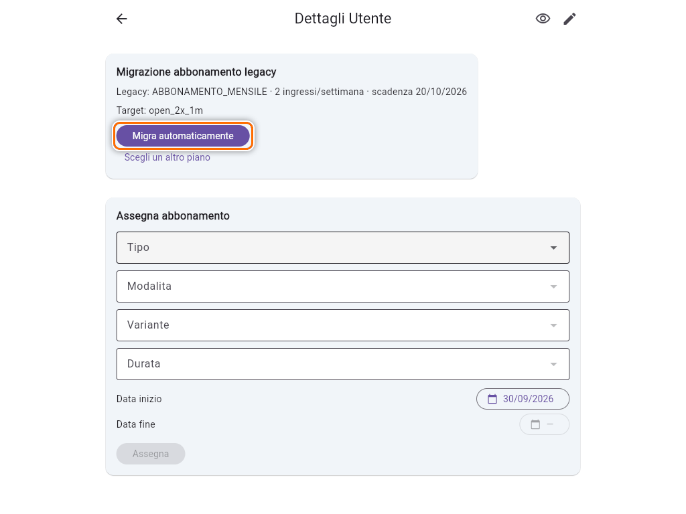
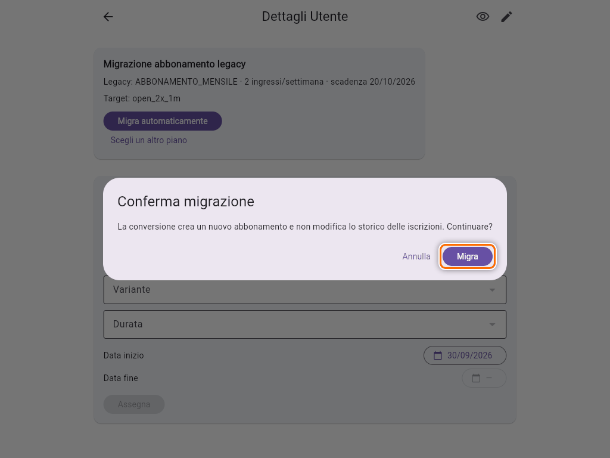
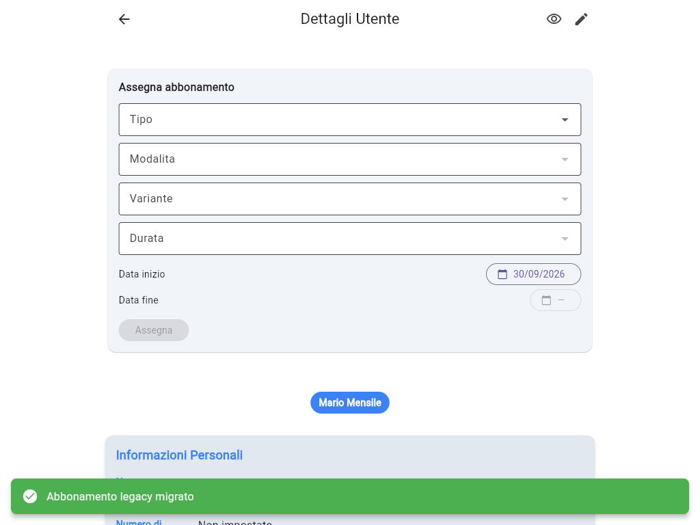
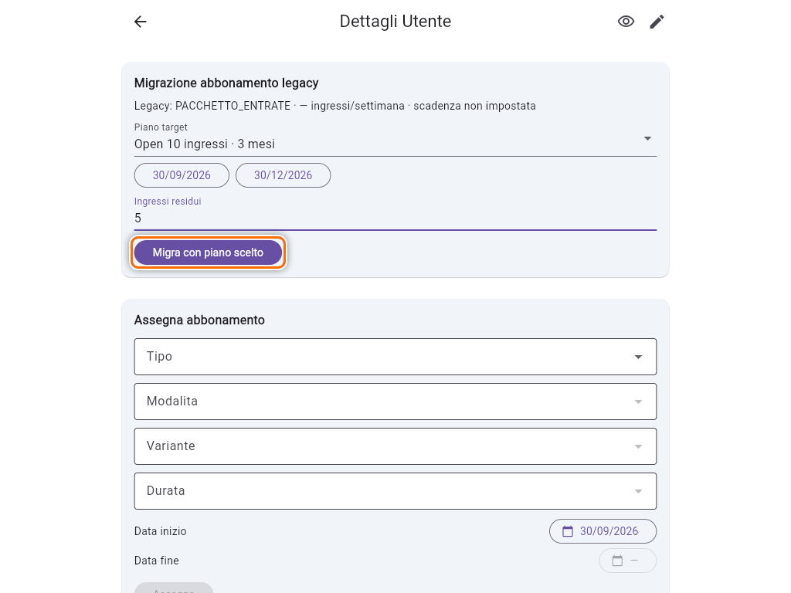
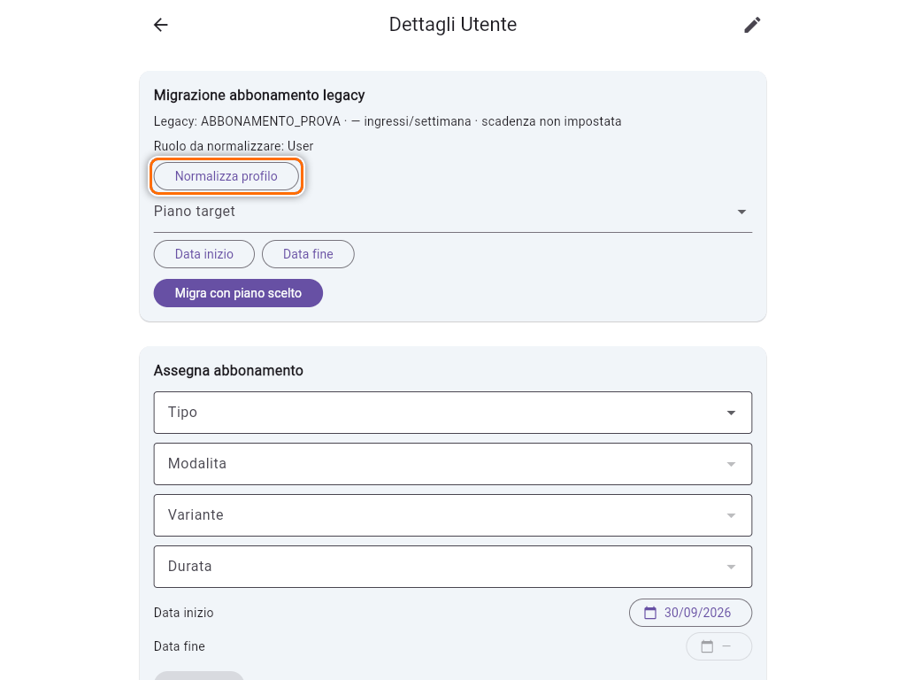
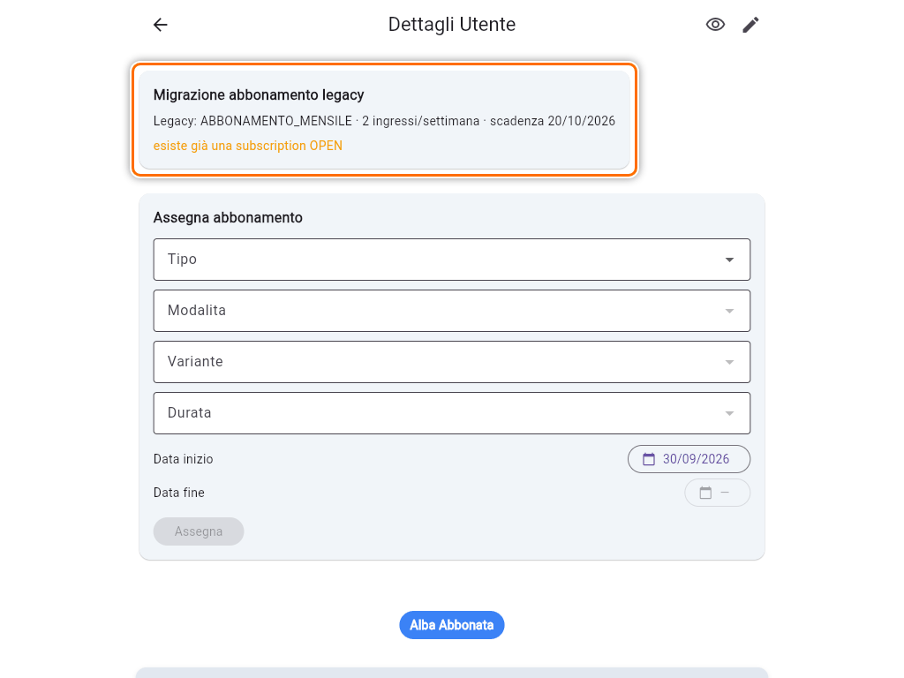

# Migrare un utente dal vecchio abbonamento

Prima degli abbonamenti attuali ogni socio aveva un solo abbonamento "vecchio stile": mensile, trimestrale, pacchetto entrate o prova. Nel dettaglio di questi soci compare in rosso la sezione **Piano di Iscrizione** con **"Modello superato — migrare l'utente al nuovo modello abbonamenti."**. In cima alla pagina, solo per gli Admin, c'è la card **Migrazione abbonamento legacy**.

Migrare significa trasformare il vecchio abbonamento in uno nuovo, equivalente. Finché un socio non è migrato non gli puoi assegnare nuovi abbonamenti: l'app risponde "L'utente è ancora sul modello legacy: eseguire prima la migrazione".

## Cosa dice la card

La prima riga riassume il vecchio abbonamento, per esempio **"Legacy: ABBONAMENTO_MENSILE · 2 ingressi/settimana · scadenza 20/10/2026"**. Sotto, la card propone una di queste strade:

- **Migra automaticamente**, quando l'app sa già a quale piano corrisponde;
- **Migra con piano scelto**, quando il piano lo devi scegliere tu;
- nessun pulsante, quando c'è un **conflitto** da risolvere prima.

## Migrazione automatica

La card mostra **Target:** con il codice del piano nuovo. Il codice si legge così:

| Codice | Piano |
|---|---|
| `open_2x_1m` | Open 2 volte/sett · 1 mese |
| `open_3x_3m` | Open 3 volte/sett · 3 mesi |
| `open_unlim_6m` | Open illimitato · 6 mesi |
| `open_10i_3m` | Open 10 ingressi · 3 mesi |
| `pt_10i_3m` | PT 10 ingressi · 3 mesi |
| `open_trial_1i_30d` | Prova Open · 1 ingresso · 30 giorni |

1. Controlla che il target corrisponda a quello che il socio ha pagato.
2. Tocca **Migra automaticamente**.

   

3. Conferma con **Migra**.

   

Compare **"Abbonamento legacy migrato"**, la card sparisce e il nuovo abbonamento è nella sezione **Abbonamenti**. La **scadenza resta la stessa** del vecchio abbonamento: l'app ricostruisce la data di inizio andando indietro della durata del piano.

Se il target non ti convince, tocca **Scegli un altro piano** e segui la procedura qui sotto.

## Migrazione con piano scelto

L'app non propone un target quando il vecchio abbonamento non ha una scadenza, quando la data di inizio ricostruita cadrebbe nel futuro, o quando il tipo di corso non è chiaro.

1. In **Piano target** scegli il piano nuovo.
2. Tocca **Data inizio** e **Data fine** e scegli le date. La fine deve corrispondere **esattamente** alla durata del piano: per un piano di 3 mesi che inizia il 30/09, la fine è il 30/12. Con date diverse la migrazione viene rifiutata.
3. Per i pacchetti scrivi gli **Ingressi residui** del socio. Qui non puoi superare gli ingressi del piano (massimo 10): se il socio ne ha di più, aggiungili dopo la migrazione con **Modifica** (vedi [Pacchetti a ingressi](guida:pacchetti-ingressi)).
4. Tocca **Migra con piano scelto** e conferma con **Migra**.

Se manca qualcosa compare "Seleziona piano, data iniziale e data finale" o "Indica gli ingressi residui".

> **Attenzione:** nell'elenco dei piani c'è anche la Prova. Sceglila solo per un socio che era davvero in prova.

## Normalizza profilo

Alcuni profili vecchi non hanno il **ruolo** o la **tipologia di corso**. La card lo segnala con righe come **"Ruolo da normalizzare: User"** o **"Tag da normalizzare: Open"**. Tocca **Normalizza profilo**: l'app completa i campi mancanti e mostra **"Profilo normalizzato"**. Poi procedi con la migrazione.

## Conflitto

Se il socio ha già un abbonamento nuovo della stessa famiglia, la card non mostra pulsanti ma il motivo, per esempio **"esiste già una subscription OPEN"**: vuol dire che il socio ha già un abbonamento Open del nuovo modello.

Decidi quale dei due è quello giusto:

- se vale quello nuovo, il vecchio non va migrato. Lascia la card così e chiedi a chi gestisce l'app di chiudere il vecchio;
- se vale il vecchio, **revoca** quello nuovo (vedi [Assegnare, modificare e revocare un abbonamento](guida:abbonamenti)) e riapri il dettaglio: la card propone di nuovo la migrazione.

## Errori durante la migrazione

- **SOURCE_DRIFT**: il profilo è cambiato mentre avevi la pagina aperta. Chiudi e riapri il dettaglio, poi riprova.
- **TARGET_CONFLICT**: nel frattempo è comparso un abbonamento della stessa famiglia. Vedi "Conflitto" qui sopra.
- **"La durata del piano non è valida in Europe/Rome"**: la data di fine non corrisponde alla durata del piano. Correggila.

## Perché lo storico non cambia

La migrazione crea un abbonamento nuovo e **non riscrive le iscrizioni passate**: i corsi già fatti restano come sono. Ricostruire a posteriori quante lezioni ha consumato ogni socio rischierebbe di creare o far sparire ingressi. Per lo stesso motivo i corsi vecchi non ancora convertiti, come **Hey Mamma**, sono **in sola lettura**: se provi a modificarli l'app risponde "I corsi storici non migrati sono disponibili in sola lettura".

Le prenotazioni future fatte con un vecchio pacchetto, invece, vengono agganciate al nuovo abbonamento: se il socio le disdice in tempo, l'ingresso torna sul pacchetto nuovo.
