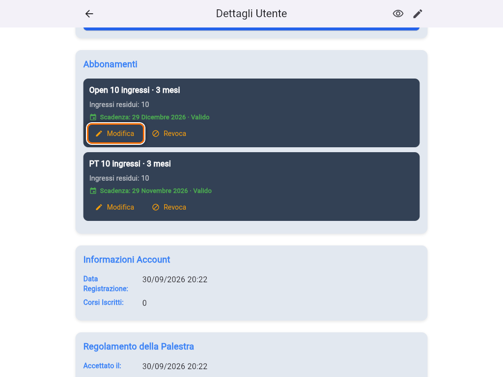
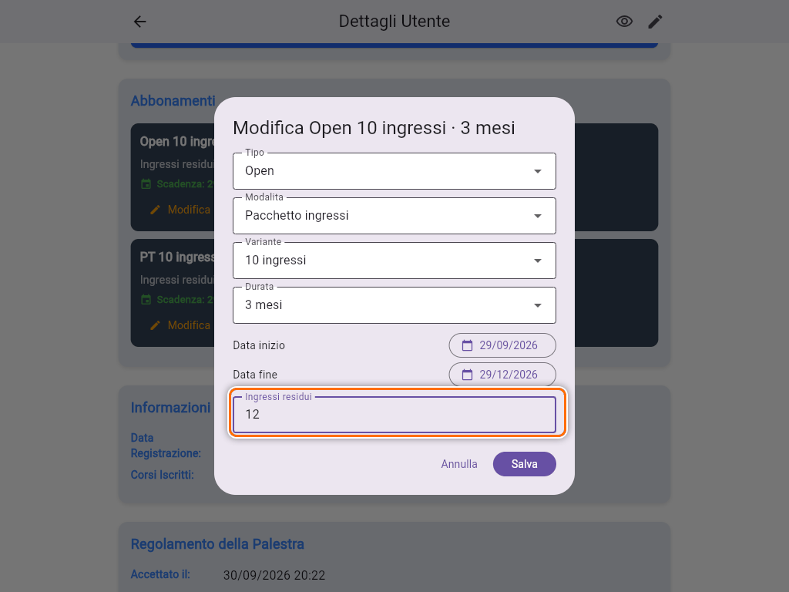
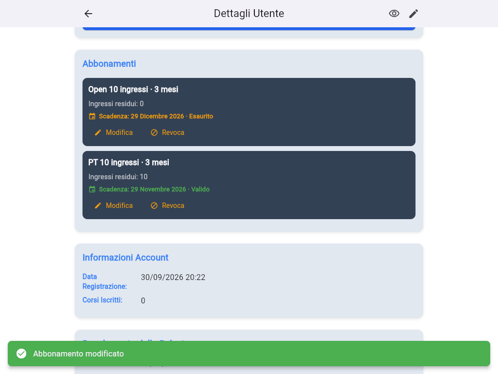
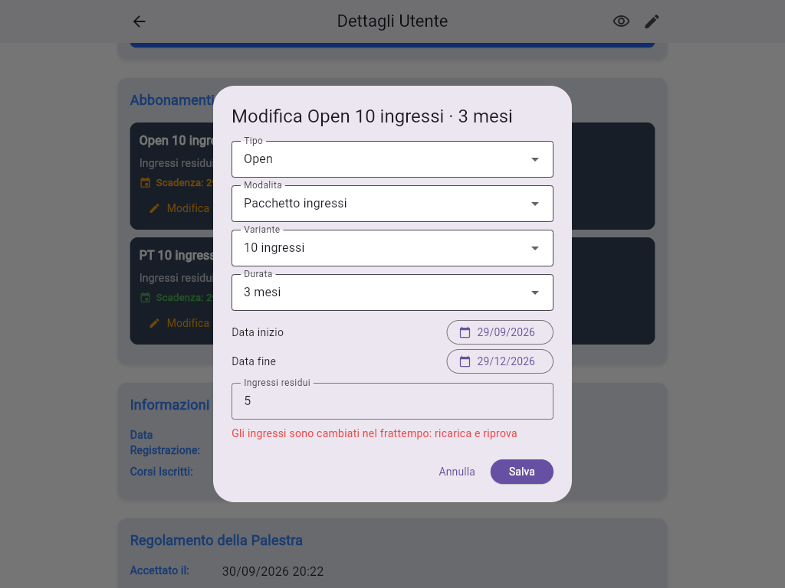

# Pacchetti a ingressi

Un **pacchetto ingressi**, per esempio "Open 10 ingressi · 3 mesi", dà al socio un numero di lezioni da usare entro la scadenza, senza limite settimanale. Si assegna come ogni altro abbonamento, scegliendo **Modalita: Pacchetto ingressi** (vedi [Assegnare, modificare e revocare un abbonamento](guida:abbonamenti)).

## Come si consumano gli ingressi

- Ogni prenotazione usa **un ingresso**, e il socio vede quanti gliene restano.
- Se il socio si disiscrive **almeno 8 ore prima** dell'inizio, l'ingresso gli torna indietro.
- Se si disiscrive **a meno di 8 ore** dall'inizio, perde l'ingresso. L'app lo avvisa prima di confermare. Può però recuperarlo prenotando **nella stessa giornata** un altro corso dello stesso tipo: in quel caso la Home gli mostra "Hai una lezione da recuperare oggi".
- Per gli abbonamenti a **frequenza settimanale** (2 o 3 volte a settimana, illimitato) la finestra è di **4 ore** invece di 8.

Quando sei **tu** a togliere un socio da un corso, l'ingresso gli viene **sempre restituito**, a qualunque ora (vedi [Iscrivere o rimuovere un socio da un corso](guida:iscrivere-socio-a-corso)).

## Vedere e correggere gli ingressi residui

Nel dettaglio del socio, sezione **Abbonamenti**, ogni pacchetto mostra **Ingressi residui**.

Per correggerli, per esempio dopo un ingresso regalato o un errore:

1. Tocca **Modifica** sul pacchetto.
2. Scrivi il nuovo numero in **Ingressi residui**.
3. Tocca **Salva**.

**Non c'è un tetto**: puoi inserire anche più ingressi di quelli del pacchetto, per esempio 12 su un pacchetto da 10. Da quel momento, anche i rimborsi possono riportare il socio fino a quel numero.

## Pacchetto esaurito

Quando gli ingressi arrivano a **0** e il pacchetto non è ancora scaduto, lo stato diventa **Esaurito**, in arancione. Il socio non può più prenotare con quel pacchetto: nel calendario vede "Entrate disponibili esaurite".

Per farlo ripartire hai due strade:

- assegna un nuovo pacchetto che inizia da oggi. Prima revoca quello esaurito, oppure fai partire il nuovo alla sua scadenza, altrimenti le date si sovrappongono;
- se il socio ha pagato qualche ingresso in più, aumenta gli **Ingressi residui**.

## "Gli ingressi sono cambiati nel frattempo"

Può capitare che, mentre hai il dialog **Modifica** aperto, il socio prenoti o disdica una lezione dal telefono. Gli ingressi cambiano sotto i tuoi occhi, e l'app non salva il tuo numero, che ormai è vecchio:

Tocca **Annulla**, chiudi e riapri il dettaglio del socio per vedere il numero aggiornato, poi rifai la modifica.

## Cambiare un pacchetto in un abbonamento settimanale

Con **Modifica** puoi anche passare da un pacchetto a un piano a frequenza settimanale. Le lezioni già prenotate con il pacchetto, però, non vengono più rimborsate come ingressi se il socio le disdice. Se ci sono prenotazioni future, valuta se conviene aspettare che finiscano.
