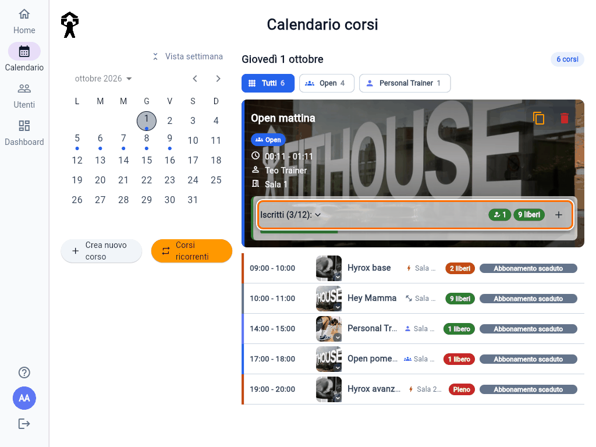
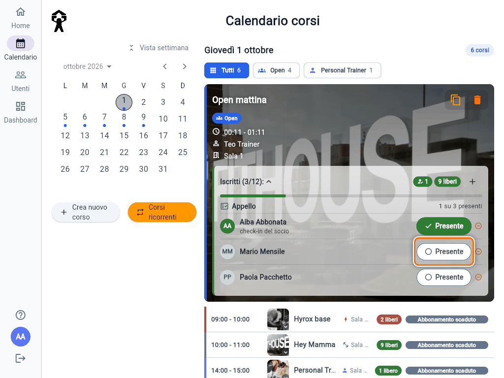
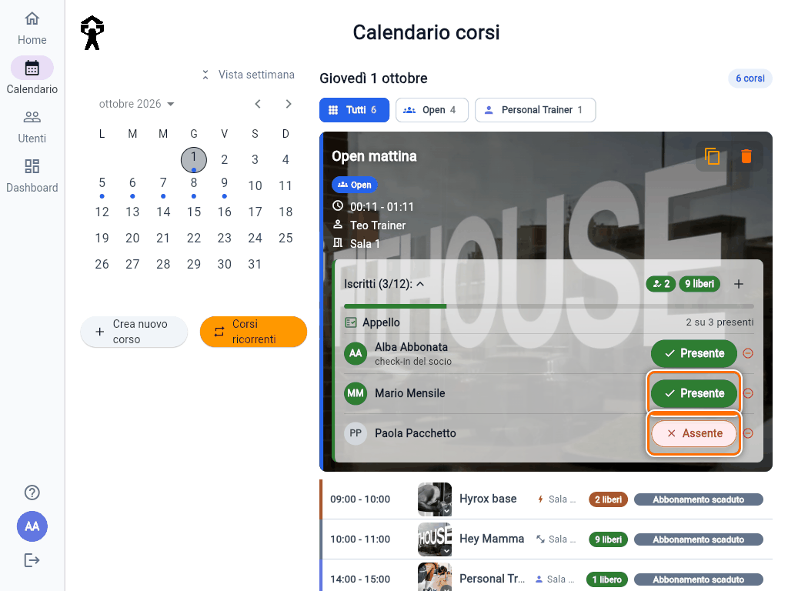

# Registrare le presenze (appello)

L'app tiene un registro di **chi era davvero in sala** a ogni lezione. Per ora serve solo a sapere chi viene e chi no: segnare un socio presente o assente **non scala ingressi** e non cambia niente nel suo abbonamento.

## Chi e quando

- Gli **Admin** possono fare l'appello di qualunque corso; i **Trainer** solo dei propri corsi e di quelli senza trainer.
- L'appello si apre **30 minuti prima dell'inizio** e resta aperto anche dopo la fine della lezione, per esempio per correggere il giorno dopo.
- Prima di quell'orario i pulsanti non compaiono.

## Fare l'appello

1. Vai su **Calendario** e apri il corso.
2. Tocca **Iscritti** per aprire la lista.

   

3. Sopra i nomi c'è la riga **Appello** con quanti presenti ci sono su quanti iscritti, per esempio **1 su 3 presenti**.
4. Accanto a ogni socio c'è un pulsante:
   - **Presente** con il cerchio vuoto: il socio non è ancora segnato;
   - **Presente** verde con la spunta: il socio è in sala;
   - **Assente** rosso con la ×: il socio è segnato assente.
5. Tocca **Presente** per segnare chi è in sala. Toccalo di nuovo se ti sei sbagliato: diventa **Assente**.

   

Ogni tocco viene salvato subito, non c'è un pulsante "Salva". Chi non tocchi resta non segnato e conta come assente.

## Il check-in del socio

Da **15 minuti prima** a **30 minuti dopo** l'inizio, il socio iscritto vede nella sua app il pulsante **Sono in sala** e può segnarsi presente da solo. Nella lista compare già verde, con la scritta **check-in del socio** sotto il nome.

- Puoi sempre correggerlo tu: dopo che lo hai segnato tu, il socio non può più cambiarlo.
- Se il socio arriva più tardi, l'app gli dice **"Check-in chiuso: chiedi al trainer di registrare la tua presenza"**: segnalo tu dalla lista.

## Da sapere

- Nel riquadro **Iscritti**, accanto ai posti liberi, il numero con l'icona della persona e la spunta è quello dei presenti.
- Si segnano solo i soci **iscritti** al corso. Se in sala c'è qualcuno che non si era prenotato, prima usa **Aggiungi iscritto** (vedi la guida "Iscrivere o rimuovere un socio da un corso"), poi segnalo presente.
- Eliminando un corso si cancellano anche le sue presenze.
