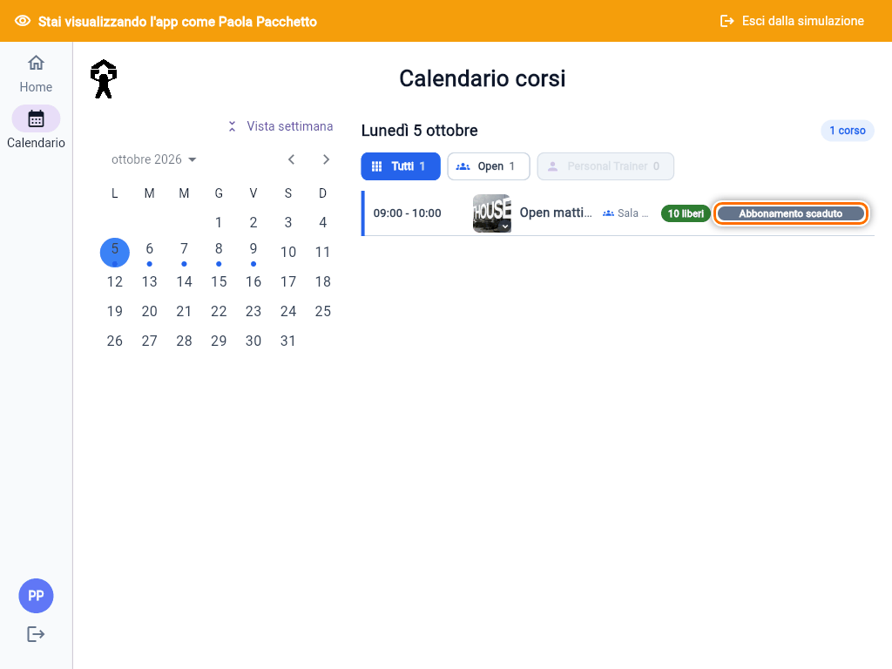
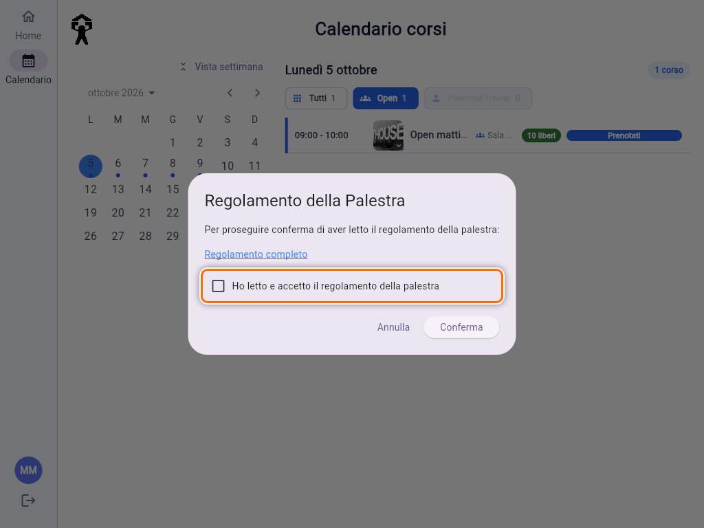

# Problemi frequenti

## Un socio non riesce a iscriversi

Il modo più rapido per capire il motivo è **vedere quello che vede lui**:

1. Apri il socio in **Utenti** e tocca l'**occhio**, "Simula utente" (vedi [Vedere l'app come un socio](guida:simula-utente)).
2. Vai in **Calendario** e apri il giorno del corso.
3. Leggi il pulsante accanto al corso: se è grigio, il testo spiega il motivo.

| Cosa vede il socio | Perché | Cosa fare |
|---|---|---|
| **Abbonamento scaduto** | Nessun abbonamento valido nel giorno del corso: scaduto, non ancora iniziato o mai assegnato | Assegna o rinnova l'abbonamento ([guida](guida:abbonamenti)) |
| **Non disponibile** | L'abbonamento non vale per quel tipo di corso, per esempio un Open su un corso Personal Trainer | Verifica la tipologia del corso e l'abbonamento del socio |
| **Entrate disponibili esaurite** | Pacchetto a 0 ingressi | Nuovo pacchetto o correzione degli ingressi ([guida](guida:pacchetti-ingressi)) |
| **Limite entrate settimanali raggiunto** | Ha già usato le lezioni della settimana (da lunedì a domenica) | Normale: può prenotare dalla settimana dopo |
| **Corso pieno** | Posti finiti e lista d'attesa spenta | Aggiungilo tu, se c'è spazio in sala ([guida](guida:iscrivere-socio-a-corso)) |
| **Lista d'attesa** (arancione) | Posti finiti: può mettersi in coda | Nessun problema: se si libera un posto, riceve un avviso |
| Nessun pulsante | Il corso è già iniziato | Se ha partecipato davvero, aggiungilo tu dal corso |

### Il regolamento

Se il socio non ha ancora accettato il regolamento, alla prima prenotazione l'app gli chiede di farlo. Deve spuntare **"Ho letto e accetto il regolamento della palestra"** e toccare **Conferma**. Se chiude la finestra con **Annulla**, la prenotazione non parte.

Durante la simulazione questa finestra non compare, perché la simulazione non scrive nulla. Per sapere se un socio ha accettato, guarda **Regolamento della Palestra** nel suo dettaglio: "Accettato il: …" oppure "Non ancora accettato". La card **Regolamento non accettato** della Home elenca chi ha un corso nei prossimi 7 giorni senza averlo accettato.

### Altri messaggi

- **"Il tuo account è stato disattivato"** al login: riattivalo (vedi [Gestire un utente](guida:gestione-utente)).
- **"Email non verificata"** al login: chi si è registrato da solo deve aprire il link nell'email di conferma. Dalla pagina di login può toccare **Invia di nuovo email**.
- **"Il corso è stato riprogrammato: riprova l'iscrizione"**: il corso è stato spostato mentre il socio prenotava. Basta riprovare.

In ogni caso puoi iscriverlo tu con **Aggiungi iscritto**, che salta tutti questi controlli (vedi [Iscrivere o rimuovere un socio da un corso](guida:iscrivere-socio-a-corso)).

## L'app non si aggiorna

L'app controlla da sola se c'è una versione nuova: all'apertura, ogni 5 minuti e ogni volta che torna in primo piano. Se la trova, si ricarica da sola, senza chiedere niente. Dopo un aggiornamento possono però servire **fino a 30 minuti** perché la versione nuova arrivi a tutti.

Se un socio vede ancora la versione vecchia:

1. **Chiudere e riaprire l'app.** Su iPhone e Android, se è installata sulla schermata Home, va chiusa anche dall'elenco delle app aperte, non solo ridotta.
2. **Aspettare qualche minuto** e riaprirla.
3. **Da computer**, ricaricare forzando: **Ctrl+Shift+R**, oppure **Cmd+Shift+R** su Mac.
4. Come ultima possibilità, **rimuovere l'app dalla schermata Home e aggiungerla di nuovo** dal browser. Dopo la reinstallazione bisogna rifare il login e, su iPhone, riattivare le notifiche.

## "Impossibile caricare la pagina"

Il messaggio completo è **"Impossibile caricare la pagina. Controlla la connessione e ricarica."**. Compare quando una parte dell'app non si è scaricata, di solito per una connessione debole o subito dopo un aggiornamento. Si risolve **ricaricando la pagina**, o chiudendo e riaprendo l'app. Se continua, controllare la connessione.

## Le notifiche push su iPhone

Su iPhone e iPad le notifiche arrivano **solo se l'app è installata sulla schermata Home**:

1. Aprire l'app in **Safari**, toccare **Condividi** e poi **Aggiungi alla schermata Home**.
2. Aprire l'app **dall'icona** sulla Home, non da Safari, e fare il login.
3. Nel proprio profilo toccare la matita, attivare **Notifiche Push**, salvare e accettare la richiesta di permesso.

Se il socio aveva detto di no al permesso, l'app mostra **"Permesso notifiche non abilitato"**. In quel caso va riattivato dalle **Impostazioni dell'iPhone → Notifiche**, cercando l'app. Su Android e computer si riattiva dalle impostazioni del browser.

## Le email finiscono nello spam

Le email dell'app (conferma della registrazione, reset password, promemoria, lista d'attesa) a volte finiscono in **spam** o **posta indesiderata**, soprattutto con Hotmail e Outlook. Chiedi al socio di:

- controllare la cartella spam o posta indesiderata;
- segnare l'email come **"Non è spam"**, così le prossime arrivano in posta in arrivo;
- se è l'email per la password, rimandarla dopo qualche minuto con **Invia Email Reset Password** (vedi [Gestire un utente](guida:gestione-utente)).

## "Gli ingressi sono cambiati nel frattempo"

Compare nel dialog **Modifica** di un pacchetto quando il socio ha prenotato o disdetto mentre lo stavi modificando. Annulla, riapri il dettaglio del socio e rifai la modifica (vedi [Pacchetti a ingressi](guida:pacchetti-ingressi)).

## "Email già associata"

- **"Questa email è già associata a un profilo. Contatta la palestra."**, o **"Questa email è già utilizzata. Se è già presente in un profilo Fit House, contatta la palestra."** quando si registra un socio: esiste già un socio con quell'indirizzo. Di solito è la stessa persona, già inserita dalla reception. Cercala in **Utenti** e, se serve, rimandale l'email per la password: non creare un doppione.
- **"Questa email è già associata a un account."**: l'indirizzo è già usato per un accesso all'app. Anche qui, cerca l'utente esistente.
