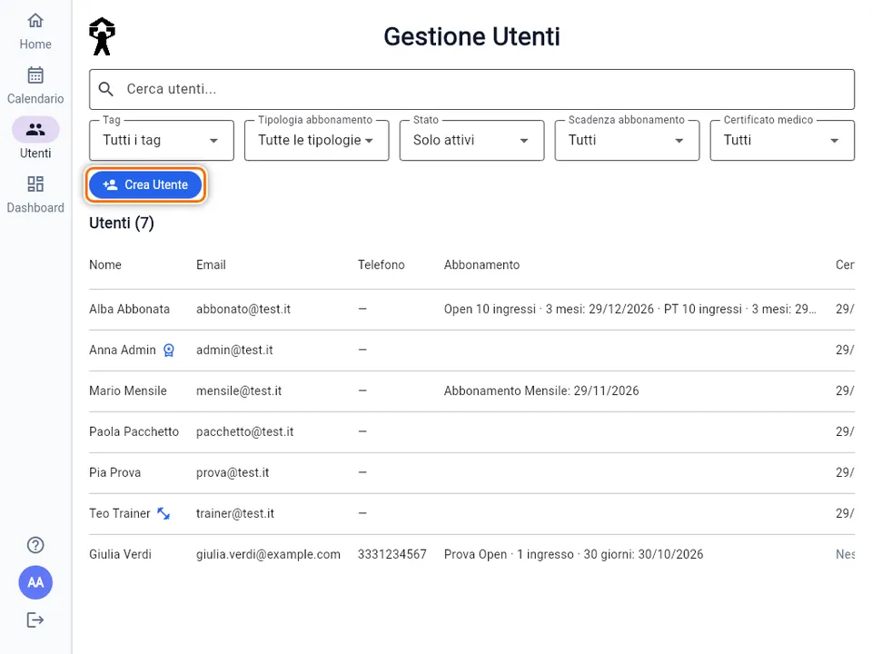
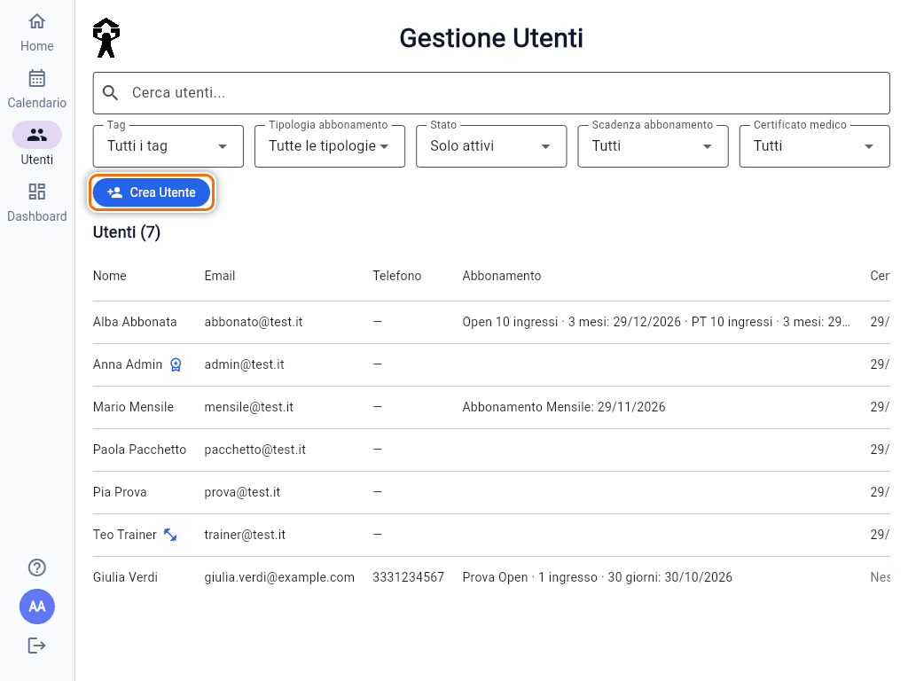
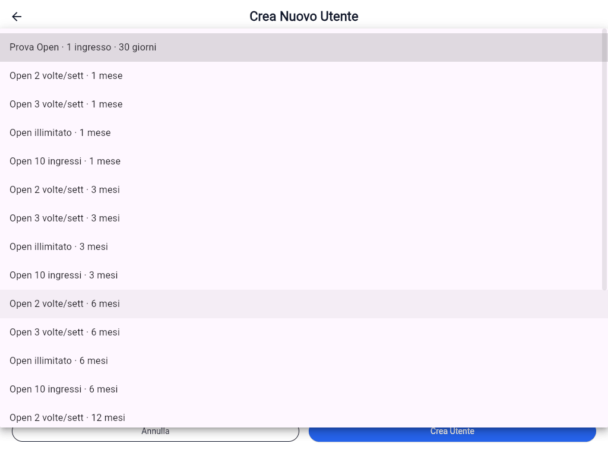
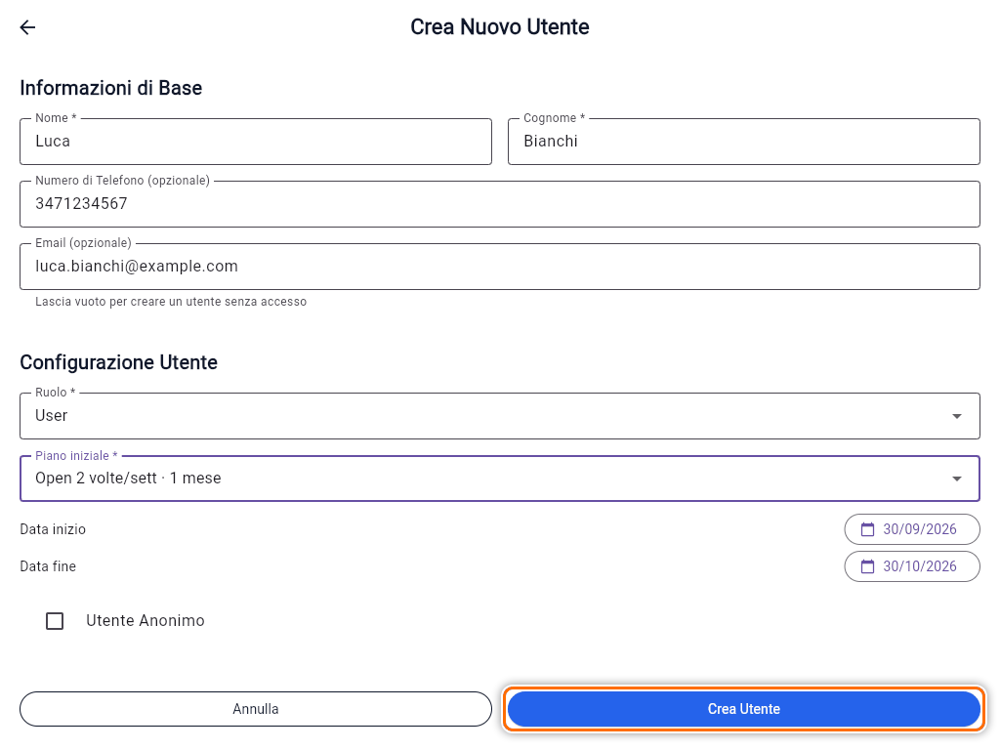
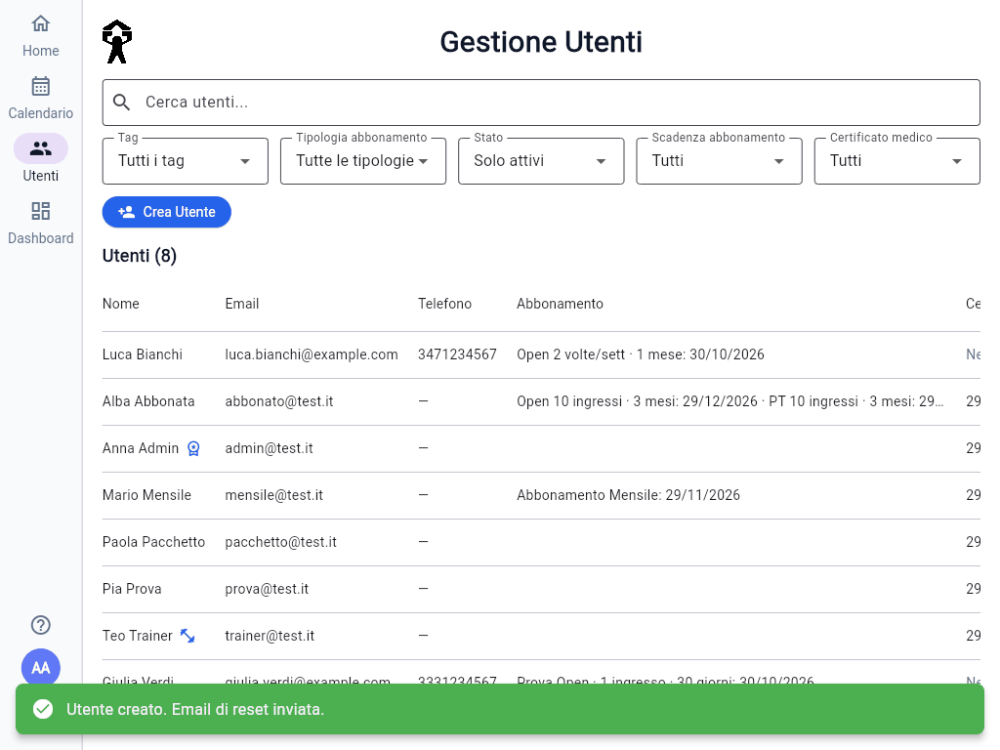
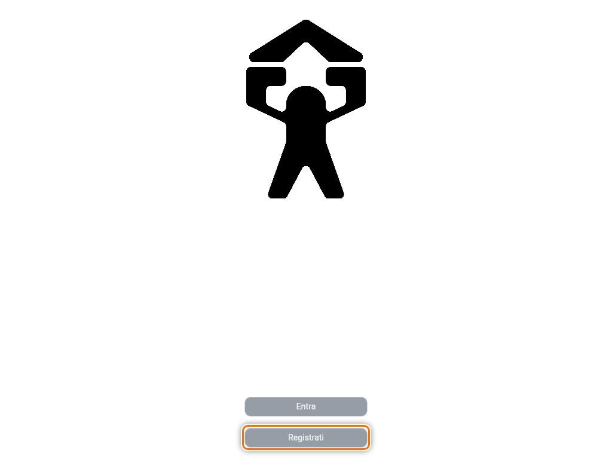
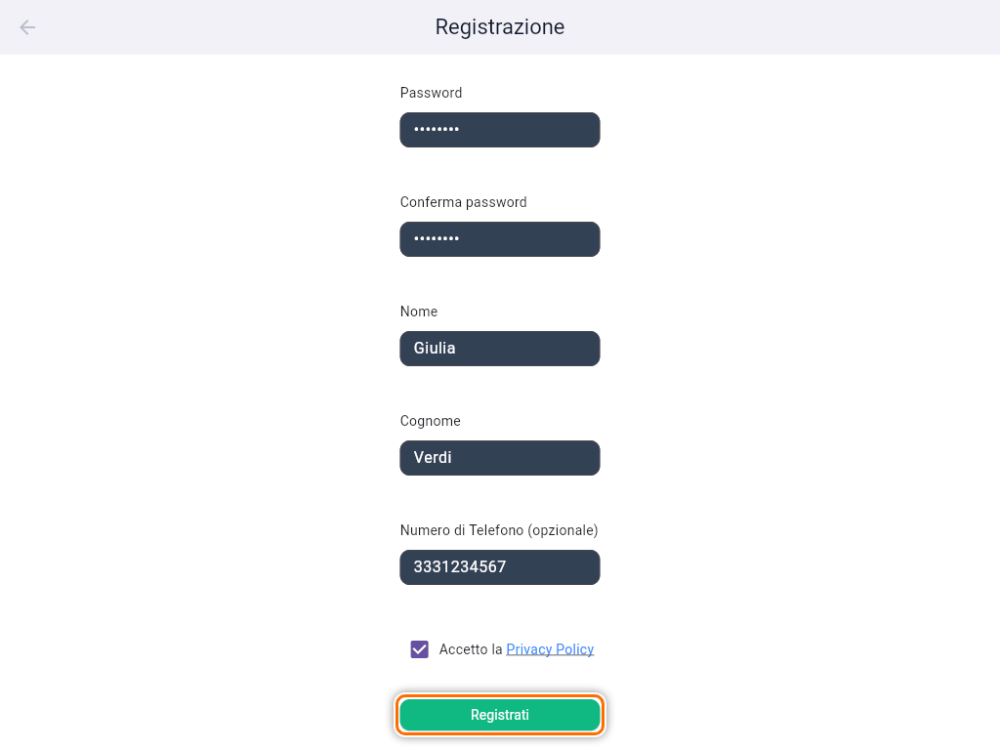
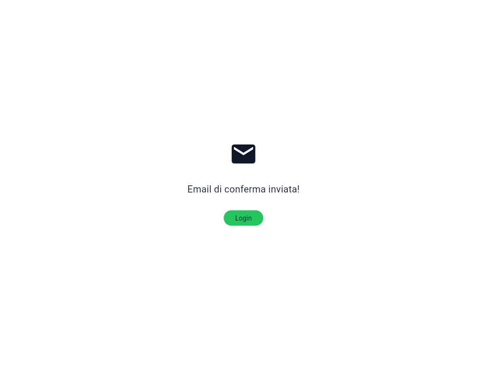

# Registrare un nuovo utente

Un nuovo socio può entrare nell'app in due modi: lo crei tu dalla sezione **Utenti**, oppure si registra da solo dalla pagina di benvenuto. Solo un Admin può creare utenti.

## Creare un utente dalla sezione Utenti

1. Nel menu a sinistra apri **Utenti** e tocca **Crea Utente**.

   

2. Compila **Nome \*** e **Cognome \***, obbligatori. Il **Numero di Telefono** è facoltativo, ma se lo inserisci deve avere esattamente 10 cifre, senza spazi né prefisso.
3. Scrivi l'**Email** se il socio userà l'app. Puoi anche lasciarla vuota: vedi più sotto "Utenti senza email".
4. In **Ruolo \*** lascia **User** per un socio. Scegli **Trainer** o **Admin** solo per lo staff: questi ruoli non hanno abbonamento, quindi il piano iniziale sparisce.
5. In **Piano iniziale \*** scegli l'abbonamento con cui parte il socio. Di proposta c'è la **Prova Open · 1 ingresso · 30 giorni**.

   

6. Controlla **Data inizio** e **Data fine**. La fine si calcola da sola in base al piano, ma puoi cambiarla toccando la data.
7. Tocca **Crea Utente**.

   

Se hai inserito l'email, compare il messaggio **"Utente creato. Email di reset inviata."** e il nuovo socio è nell'elenco.

### Cosa riceve il socio

Non scegli tu la password del socio. L'app gli manda un'email per **impostare la password**. Quando la imposta dal link, l'indirizzo risulta anche verificato e il socio può entrare con **Entra**.

Se l'email non arriva:

- chiedigli di controllare la cartella **spam** o **posta indesiderata**;
- rimandala dal dettaglio utente con **Invia Email Reset Password** (vedi [Gestire un utente](guida:gestione-utente)).

Se invece compare **"Utente creato, ma non è stato possibile inviare il reset. Potrai ritentare dal dettaglio utente."**, l'utente è stato creato correttamente e devi solo rimandare l'email.

### Utenti senza email

Lascia l'email vuota per chi non userà l'app, per esempio un socio che prenota solo alla reception. L'utente esiste e puoi iscriverlo ai corsi, ma **non può accedere**. Se in seguito vuole usare l'app, aggiungi l'email dal suo dettaglio (vedi [Gestire un utente](guida:gestione-utente)): l'email per impostare la password parte in quel momento.

### Errori frequenti

- **"Questa email è già associata a un profilo. Contatta la palestra."**: esiste già un socio con quell'indirizzo. Cercalo in **Utenti** con **Cerca utenti...** invece di crearne un altro.
- **"Questa email è già associata a un account."**: l'indirizzo è già usato per un accesso all'app. Anche qui, cerca l'utente esistente.
- **"Inserisci un'email valida"**: controlla che non ci siano spazi o caratteri mancanti. Maiuscole e minuscole non contano: l'indirizzo viene salvato tutto in minuscolo.

## La registrazione del socio da solo

Il socio può anche registrarsi dall'app, senza passare da te.

1. Nella pagina di benvenuto tocca **Registrati**.

   

2. Compila email, password (almeno 6 caratteri, da ripetere due volte), nome, cognome e, se vuole, il telefono. Spunta **Accetto la Privacy Policy** e tocca **Registrati**.

   

3. L'app mostra **"Email di conferma inviata!"**. Il socio deve aprire il link nell'email **prima** del primo accesso. Se prova a entrare prima, vede "Email non verificata" e il pulsante **Invia di nuovo email**.

   

### La Prova automatica

Chi si registra da solo riceve **in automatico una Prova Open: 1 ingresso valido 30 giorni**. Di solito la vedi subito nell'elenco Utenti. Se qualcosa va storto al momento della registrazione, la Prova viene assegnata al primo accesso.

La Prova automatica vale solo per la registrazione autonoma. Quando crei tu l'utente, il piano è quello che scegli in **Piano iniziale**.

Per passare il socio a un abbonamento vero, vedi [Assegnare, modificare e revocare un abbonamento](guida:abbonamenti).
