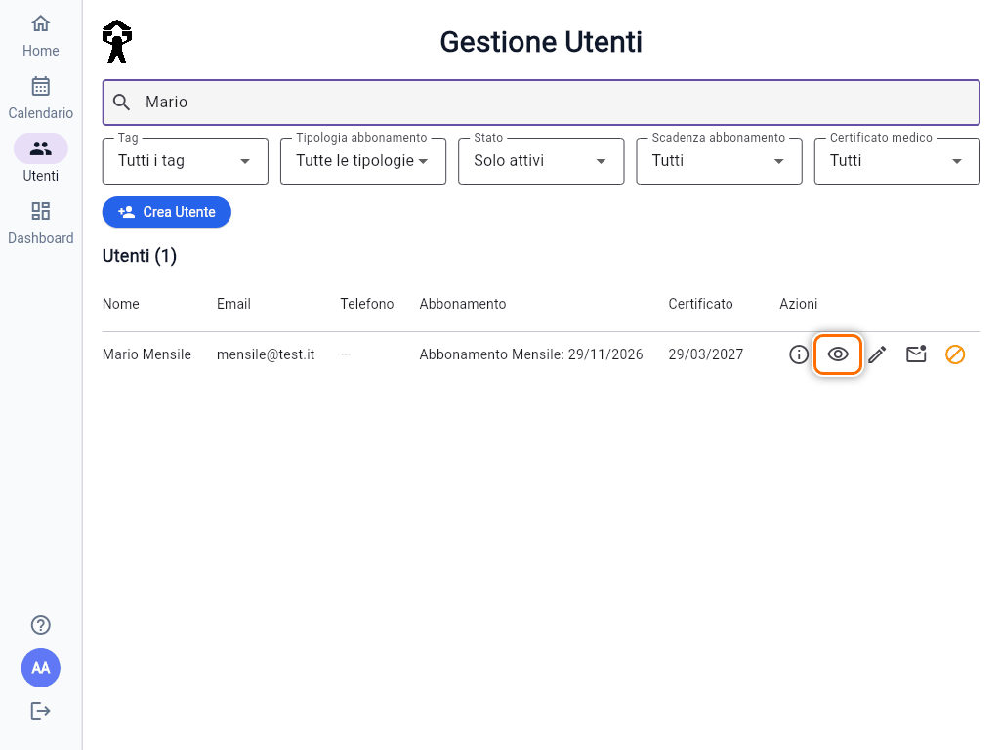
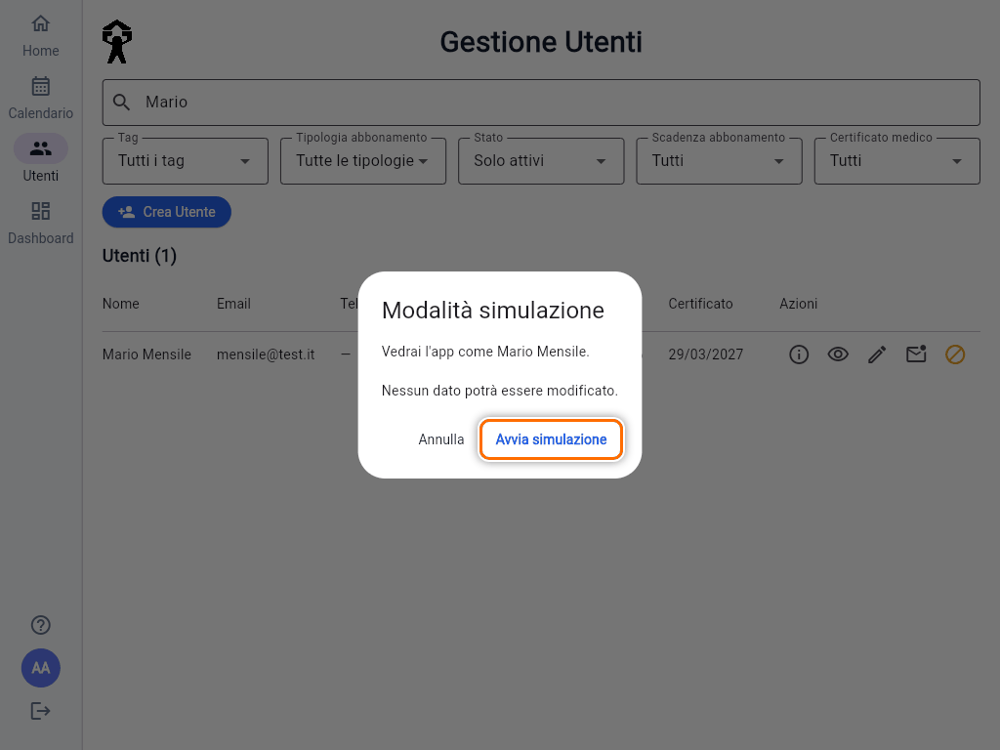
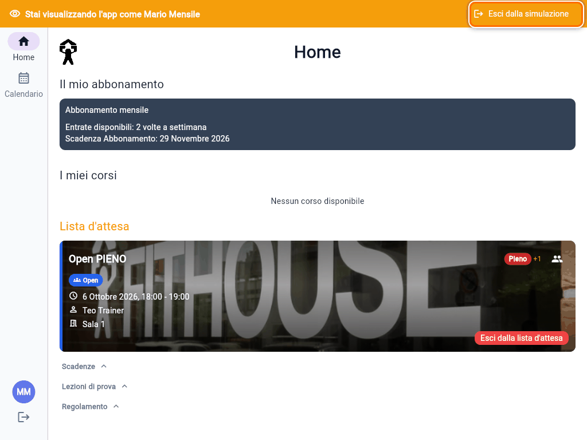
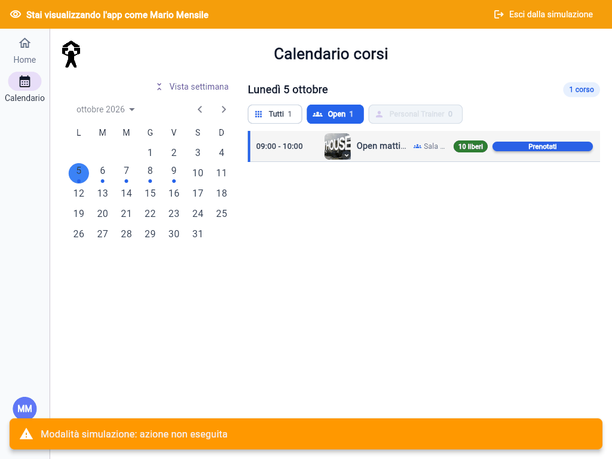

# Vedere l'app come un socio

**Simula utente** ti fa vedere l'app esattamente come la vede un socio: la sua Home, i suoi abbonamenti, i pulsanti del calendario con i colori e le scritte che vede lui. È lo strumento più rapido per capire perché un socio "non riesce a prenotare" o "non vede un corso".

La simulazione è **in sola lettura**: non puoi prenotare, disdire o modificare niente al posto del socio.

## Avviare la simulazione

1. In **Utenti** tocca l'**occhio** ("Simula utente") nella riga del socio. L'occhio c'è anche in alto nel dettaglio del socio. Su telefono si trova nel menu **⋮** della riga.

   

2. Conferma con **Avvia simulazione**.

   

L'app riparte sulla **Home del socio**. In alto compare la barra arancione **"Stai visualizzando l'app come …"**, e dal menu spariscono **Utenti** e **Dashboard**, perché il socio non li ha.

Puoi simulare solo i **soci** (ruolo User): non Trainer, non altri Admin, e non te stesso.

## Cosa puoi fare durante la simulazione

- Guardare la **Home**: abbonamento, corsi prenotati, lista d'attesa.
- Aprire il **Calendario** e leggere i pulsanti accanto ai corsi: **Prenotati**, **Abbonamento scaduto**, **Non disponibile** e così via. La tabella dei motivi è in [Problemi frequenti](guida:problemi-app).
- Toccare i pulsanti: restano colorati e cliccabili, così vedi se il socio **potrebbe** premerli. Nessuna azione viene eseguita: compare **"Modalità simulazione: azione non eseguita"**.

La finestra del regolamento e le notifiche non partono mai durante la simulazione.

## Uscire dalla simulazione

Tocca **Esci dalla simulazione** nella barra arancione: l'app torna alla tua Home, con tutti i menu Admin.

Anche **ricaricare la pagina** chiude la simulazione. Durante la simulazione invece il logout è bloccato: prima esci dalla simulazione.

> **Attenzione:** la simulazione mostra i dati del socio, ma l'accesso resta il tuo. Per questo è in sola lettura. Se devi davvero iscrivere o disiscrivere il socio, esci dalla simulazione e fallo dalla card del corso (vedi [Iscrivere o rimuovere un socio da un corso](guida:iscrivere-socio-a-corso)).
